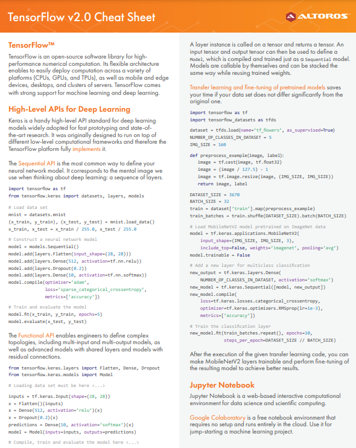

# Machine-Learning

    

[View Interactive Plot](https://plotly.com/~vg11072001/3/)

 ## Deep Learning 
   * [CS 230 ― Deep Learning Cheatsheet](https://stanford.edu/~shervine/teaching/cs-230/)
   * [Complete Deep Learning by Krish Naik](https://www.youtube.com/playlist?list=PLZoTAELRMXVPGU70ZGsckrMdr0FteeRUi) | [Notes](https://github.com/krishnaik06/Complete-Deep-Learning-With-Materials)
   * [DL Stanford CS230: 2018 Lectures from Stanford graduate course CS230 taught by Andrew Ng](https://www.youtube.com/playlist?list=PLoROMvodv4rOABXSygHTsbvUz4G_YQhOb)
   * [MIT 6.S191: Introduction to DL](https://www.youtube.com/playlist?list=PLtBw6njQRU-rwp5__7C0oIVt26ZgjG9NI)
   * [MIT 6.S192: Deep Learning for Art, Aesthetics, and Creativity](https://www.youtube.com/playlist?list=PLCpMvp7ftsnIbNwRnQJbDNRqO6qiN3EyH)
   * [Convolutional Neural Networks for Visual Recognition](https://www.youtube.com/playlist?list=PL3FW7Lu3i5JvHM8ljYj-zLfQRF3EO8sYv)
   * [Deep Learning Architectures Comparative Analysis](https://aman.ai/primers/ai/dl-comp/)
   * [Deep Learning Specialization on Coursera (offered by deeplearning.ai)](https://aman.ai/coursera-dl/)
      * https://github.com/ashishpatel26/Andrew-NG-Notes
      * https://github.com/SHANK885/Machine-Learning-Andrew-Ng
   * http://introtodeeplearning.com/2021/index.html
   * https://d2l.ai/chapter_preface/index.html#about-this-book
   * https://www.deeplearningbook.org/front_matter.pdf

### Pytorch
 * [Project: generate your data in parallel with PyTorch](https://stanford.edu/~shervine/blog/pytorch-how-to-generate-data-parallel)
 * [Zero to Mastery Learn PyTorch for Deep Learning](https://www.learnpytorch.io/pytorch_extra_resources/)
 * [git: the-incredible-pytorch](https://github.com/ritchieng/the-incredible-pytorch)
 * [PyTorch Tutorial: How to Develop Deep Learning Models with Python](https://machinelearningmastery.com/pytorch-tutorial-develop-deep-learning-models/)

### Tensorflow
  
 * [View PDF](Reading/TensorFlow2Cheatsheet.pdf)
 
## NLP/LLM
* [Understanding Large Language Models](https://magazine.sebastianraschka.com/p/understanding-large-language-models)
* [Stanford CS224D: Natural Language Processing with Deep Learning](https://web.stanford.edu/class/cs224n/)
* 

 ## Data Science
 * [Data Science Tools Standford student](https://www.mit.edu/~amidi/teaching/data-science-tools/)

## Reasearch Papers
* https://aman.ai/papers/

## Learning Material
* https://github.com/vg11072001/applied-ml
* https://imisra.github.io/

## Extra Resources
* [GAN - Generative Adversarial Networks](https://drive.google.com/file/d/1Gm4hNSXY03DrYDU4rh0NRlDcXo20a3pL/view)
* [Swiggy- Data Science blogs](https://bytes.swiggy.com/tagged/swiggy-data-science)
* [Amazon Science blogs](https://www.amazon.science/blog?q=&f0=0000016e-2ff1-d205-a5ef-aff9651e0000&f1=0000016e-4373-de2e-a76e-cff717cf0000&f1=0000016e-39f9-d205-a5ef-bff9944b0000&s=0&expandedFilters=Research%2520area%2CTag%2CConference%2CAuthor%2CDate%2C)
* [ML/ Recommendation Netflix Research](https://research.netflix.com/research-area/machine-learning)

## Interesting Blogs
* [Getting started with Machine Learning in MS Excel using XLMiner](https://www.analyticsvidhya.com/blog/2015/11/started-machine-learning-ms-excel-xl-miner/)
* [When You Should Not Use Accuracy to Evaluate Your Machine Learning Model](https://towardsdatascience.com/when-you-should-not-use-accuracy-to-evaluate-your-machine-learning-model-4d58f16968e6)
* [What are the disadvantages of accuracy?](https://datascience.stackexchange.com/questions/110124/what-are-the-disadvantages-of-accuracy)
* [3 Best metrics to evaluate Regression Model?](https://towardsdatascience.com/what-are-the-best-metrics-to-evaluate-your-regression-model-418ca481755b)
* [Hyperparameter Tuning the Random Forest in Python](https://towardsdatascience.com/hyperparameter-tuning-the-random-forest-in-python-using-scikit-learn-28d2aa77dd74)
* [A Beginner’s Guide to Random Forest Hyperparameter Tuning](https://www.analyticsvidhya.com/blog/2020/03/beginners-guide-random-forest-hyperparameter-tuning/)
* [15 Generative Adversarial Networks (GAN) Based Project Ideas](https://www.projectpro.io/article/generative-adversarial-networks-gan-based-projects-to-work-on/530)
* [Breaking it Down: Logistic Regression](https://towardsdatascience.com/breaking-it-down-logistic-regression-e5c3f1450bd)
* [ML Collaboration: Best Practices From 4 ML Teams](https://neptune.ai/blog/ml-collaboration-best-practices-from-ml-teams)
* [An ML approach for routing payment transactions](https://bytes.swiggy.com/an-ml-approach-for-routing-payment-transactions-5a14efb643a8)
* [Structure of Data Science Projects](https://www.linkedin.com/posts/dhananjai-singh-852351142_structure-of-data-science-project-activity-7026032488997105664-Z_Qf?utm_source=share&utm_medium=member_desktop)
* [How a machine learning project pipeline is build](https://youtu.be/0iQT5XfbadE)
* [A visual introduction to machine learning](http://www.r2d3.us/visual-intro-to-machine-learning-part-1)

## Kaggle projects
* [Introduction to GANIME](https://www.kaggle.com/code/mrigendraagrawal/introduction-to-ganime)
* [Image Colorization Process / Auto-Encoder](https://www.kaggle.com/code/brsdincer/image-colorization-process-auto-encoder)

## Extra
* https://cs231n.github.io/python-numpy-tutorial/
* http://cs231n.stanford.edu/
* https://www.deeplearning.ai/about/

