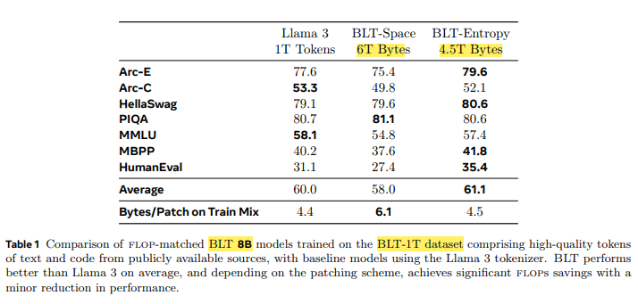
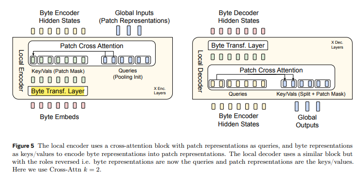

<!-- # Byte-Level Transformers: A Solution to Tokenization Challenges -->

# Breaking Tokens: Transformers that Speak in Byte-Level

Meta AI recently released a groundbreaking model, Byte-Latent Transformer (BLT), that tackles tokenization challenges head-on. 
[Paper Link](https://ai.meta.com/research/publications/byte-latent-transformer-patches-scale-better-than-tokens)

Tokenization has been a bottleneck in LLM capabilities for years. With BLT’s byte-level approach, check out some challenges raise by Andrej Karatpathy - `Let's build the GPT Tokenizer` [link](https://www.youtube.com/watch?v=zduSFxRajkE&t=910s) mentioned below.

1. Why can't LLM spell words? Why can't LLM do super simple string processing tasks like reversing a string? Reason: **Tokenization**
   - BLT surpasses Llama 3's BPE tokenization on the **CUTE** benchmark, excelling in Understanding composition,  Grasping orthographic similarity andManipulating sequences effectively. These results highlight BLT's ability to handle sequence-level challenges with greater accuracy.
   - 

2. Why is LLM worse at non-English languages (e.g. Japanese)? Reason: **Tokenization** 
   - BLT models  demonstrate    
     - Robustness to noisy inputs
     - Enhanced character-level understanding, excelling in orthographic knowledge and phonology.
     - Improved performance in low-resource machine translation tasks, as benchmarked on FLORES-101, achieving comparable or better results.
   - 

3. Why did GPT-2 have more than necessary trouble coding in Python? Reason: **Tokenization**
   - BLT-Entropy with 4.5T bytes achieved groundbreaking results due to:
     - Better utilization of training compute through dynamic patching.
     - Direct modeling of byte-level information, eliminating the limitations of token-based approaches.
    This allows BLT to handle programming languages like Python with greater accuracy and efficiency.
    - 
  
4. Why did my LLM abruptly halt when it sees those string "<|elendoftoxtl|>"? Reason: **Tokenization**
   - BLT potentially mitigate this issue by eliminating the need for a fixed vocabulary of tokens. Instead of relying on predefined tokens, BLT dynamically groups bytes into patches based on the entropy of the next-byte prediction.

5. What is this weird warning I got about a "trailing whitespace"? Reason: **Tokenization**
   - BLTs use entropy patching and process text at the byte level, including whitespace. This, eliminating ambiguity and enabling more precise handling of text, including trailing whitespaces.
   - Contextual Understanding: BLTs can learn the context of whitespace and its significance (e.g., trailing whitespace in code vs. natural language), making them more robust to text irregularities and reducing such warnings.
   - 

6. Why is LLM not actually end-to-end language modeling? Reason: **Tokenization**
   - Byte-Level Processing: BLTs operate at the byte level, eliminating the need for complex tokenization schemes and reducing discretization errors.
   - Improved Handling of OOV Words: By working with bytes, BLTs can represent out-of-vocabulary words and learn finer-grained morphological patterns directly.
	- Reference : [Byte Latent Transformer: Patches Scale Better Than Tokens | Hacker News](https://news.ycombinator.com/item?id=42415122) 
	- more: [I really hope Dynamic Byte Latent Transformers work out. Death to tokenizers! In... | Hacker News](https://news.ycombinator.com/item?id=42413430)

   - BLT architecture:
     - 
     - 
   - Limitations of BLTs:
     - They still require segmentation, like patch-based attention.
     - BLTs may struggle with very long sequences due to computational constraints.
     - Their effectiveness can depend on the specific task or dataset.
   - While BLTs significantly improve over traditional tokenization, further research is needed to achieve truly end-to-end language modeling.

7. What is tho real root Of suffering? Reason: **Tokenization**   
   - BLT, a byte-latent LLM architecture that improves FLOP efficiency by dynamically allocating compute. BLT achieves parity with Llama 3 (up to 8B scale) while offering up to 50% FLOP efficiency gains and enabling scalable model sizes within fixed inference budgets. Additionally, BLT demonstrates robustness to input noise and captures sub-word details missed by token-based models.

These are some more questions, I'm planning to explain better after implementing the paper on my own setup:

8. Why is LLM bad at simple arithmetic? Reason: **Tokenization**
9. Why tho LLM break if I ask it about "SolidGoldMagikarp"? Reason: **Tokenization**
10. Why shouki I prefer to use YAML over JSON with LLMs? Reason: **Tokenization**

Feel free to share any suggestions or corrections in the comments below!