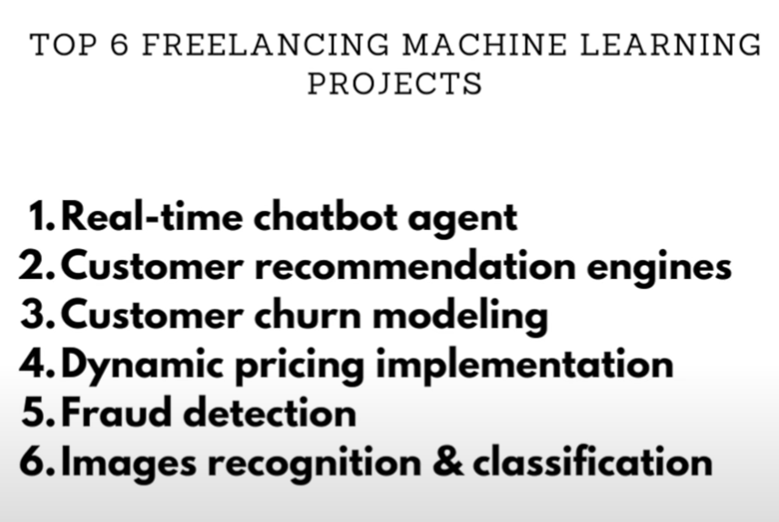

# Sequence 

## Resources
* ML for Developers [link](https://madewithml.com/)
* https://github.com/ngupta23
* Hugging Face: https://huggingface.co/
* https://github.com/0xD4rky?tab=repositories
* Portfolio: https://karpathy.ai/

## Tools
- ![[Pasted image 20241026204851.png]]

- Ref: [A Complete Machine Learning Project From Scratch: Setting Up](https://www.mihaileric.com/posts/setting-up-a-machine-learning-project/ )

- ![[Pasted image 20241115111956.png]]

- https://viso.ai/deep-learning/deep-learning-software/

- 

---

Frelance ML :
- toptal
- Braintrust

Links:
[[Open source]]
[[Inspirations]]
