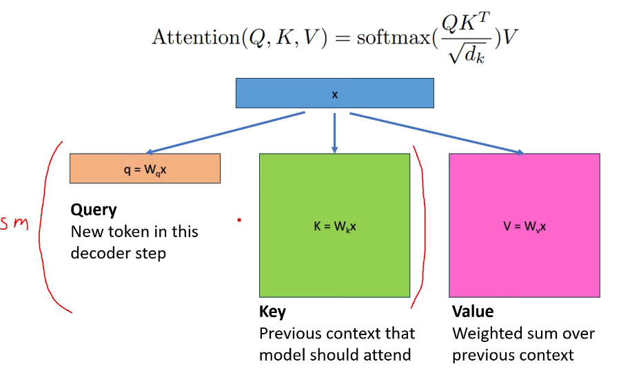
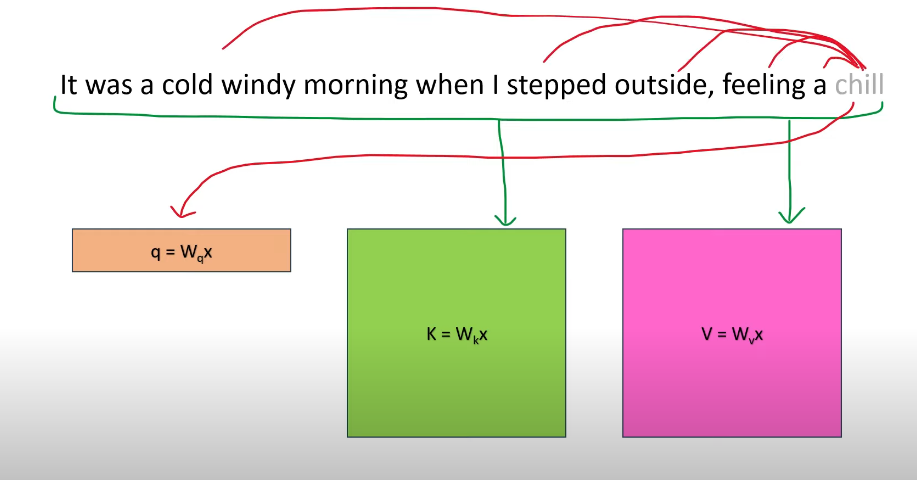

## Roots:

Attention Is All You Need : [PDF](nn-zero-to-hero/lectures/11.Attention-All-You-Need.pdf)

## 1. 3Blue1Brown 

### Attention in transformers, visually explained | DL6 [Link](https://www.youtube.com/watch?v=eMlx5fFNoYc&t=269s)

Here are a few other relevant resources

Build a GPT from scratch, by Andrej Karpathy
- Let's build GPT: from scratch, in cod...  

If you want a conceptual understanding of language models from the ground up, @vcubingx just started a short series of videos on the topic:
- What does it mean for computers to un...  

If you're interested in the herculean task of interpreting what these large networks might actually be doing, the Transformer Circuits posts by Anthropic are great. In particular, it was only after reading one of these that I started thinking of the combination of the value and output matrices as being a combined low-rank map from the embedding space to itself, which, at least in my mind, made things much clearer than other sources.
-  A Mathematical Framework for Transformer Circuits : https://transformer-circuits.pub/2021/framework/index.html
- https://transformer-circuits.pub/

Site with exercises related to ML programming and GPTs
https://www.gptandchill.ai/codingprob...

History of language models by Brit Cruise,  @ArtOfTheProblem  
- [ChatGPT: 30 Year History (How AI Lear...  ](https://www.youtube.com/watch?v=OFS90-FX6pg)

An early paper on how directions in embedding spaces have meaning:
- Efficient Estimation of Word Representations in
Vector Space : https://arxiv.org/pdf/1301.3781.pdf

#### Links to explore:

- A Mathematical Framework for Transformer Circuits : https://transformer-circuits.pub/2021/framework/index.html

### How might LLMs store facts | DL7 [Link](https://www.youtube.com/watch?v=9-Jl0dxWQs8&list=PLZHQObOWTQDNU6R1_67000Dx_ZCJB-3pi&index=8)

Unpacking the multilayer perceptrons in a transformer, and how they may store facts

Sections:
* 0:00 - Where facts in LLMs live
* 2:15 - Quick refresher on transformers
* 4:39 - Assumptions for our toy example
* 6:07 - Inside a multilayer perceptron
* 15:38 - Counting parameters
* 17:04 - Superposition
* 21:37 - Up next

Rescources: 
- AI Alignment forum post from the Deepmind researchers referenced at the video's start:
  - Fact Finding: Attempting to Reverse-Engineer Factual Recall on the Neuron Level [(Post 1)](https://www.alignmentforum.org/posts/iGuwZTHWb6DFY3sKB/fact-finding-attempting-to-reverse-engineer-factual-recall)

- Anthropic posts about superposition referenced near the end:
  - https://transformer-circuits.pub/2022/toy_model/index.html 
  - https://transformer-circuits.pub/2023/monosemantic-features

Some added resources for those interested in learning more about mechanistic interpretability, offered by Neel Nanda

- Mechanistic interpretability paper reading list
    - An Extremely Opinionated Annotated List of My Favourite Mechanistic Interpretability [Papers v2](https://www.alignmentforum.org/posts/NfFST5Mio7BCAQHPA/an-extremely-opinionated-annotated-list-of-my-favourite)

- Getting started in mechanistic interpretability
https://www.neelnanda.io/mechanistic-interpretability/getting-started 

- An interactive demo of sparse autoencoders (made by Neuronpedia)
https://www.neuronpedia.org/gemma-scope#main

- Coding tutorials for mechanistic interpretability (made by ARENA)
https://arena3-chapter1-transformer-interp.streamlit.app/

## 2. Jay Alamar Language AI & NLP Playlist [Link](https://www.youtube.com/playlist?list=PLTx9yCaDlo1UlgZiSgEjq86Zvbo2yC87d)

- https://jalammar.github.io/
- https://newsletter.languagemodels.co/ 

### 2nd Transformer Video

- Blog Post https://jalammar.github.io/illustrated-transformer/
  
- 
- 

#### Go Forth And Transform
I hope you’ve found this a useful place to start to break the ice with the major concepts of the Transformer. If you want to go deeper, I’d suggest these next steps:

- Read the Attention Is All You Need paper, the Transformer blog post (Transformer: A Novel Neural Network Architecture for Language Understanding), and the Tensor2Tensor announcement.
- Watch Łukasz Kaiser’s talk walking through the model and its details
- Play with the Jupyter Notebook provided as part of the Tensor2Tensor repo
- Explore the Tensor2Tensor repo.

#### Follow-up works Papers:

- Depthwise Separable Convolutions for Neural Machine Translation
- One Model To Learn Them All
- Discrete Autoencoders for Sequence Models
- Generating Wikipedia by Summarizing Long Sequences
- [Image Transformer](https://arxiv.org/abs/1802.05751)
- Training Tips for the Transformer Model
- Self-Attention with Relative Position Representations
- Fast Decoding in Sequence Models using Discrete Latent Variables
- Adafactor: Adaptive Learning Rates with Sublinear Memory Cost

## 3. Medium Amazing Things Happen When Attention Heads Are Supercharged Using Mixture-Of-Experts [Link](https://levelup.gitconnected.com/amazing-things-happen-when-attention-heads-are-supercharged-using-mixture-of-experts-b55a6b9a0ac8)

Further Reading
Research paper titled ‘MoH: Multi-Head Attention as a Mixture of Head Attention’ published in ArXiv
GitHub repository containing the code for MoH Attention
Research paper titled ‘Mixture of Attention Heads: Selecting Attention Heads Per Token’ published in ArXiv

## 4. Medium RAG From Scratch [Link](https://pub.towardsai.net/rag-from-scratch-66c5eff02482)
- Good explanations