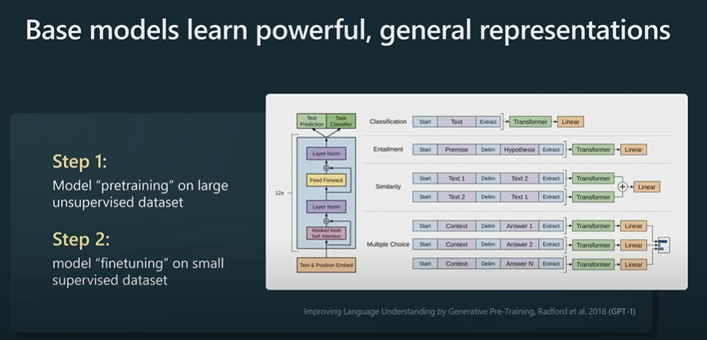
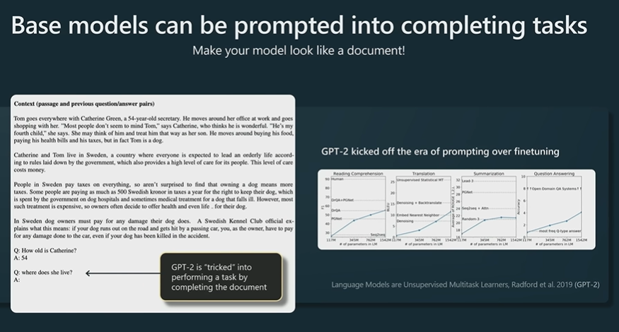
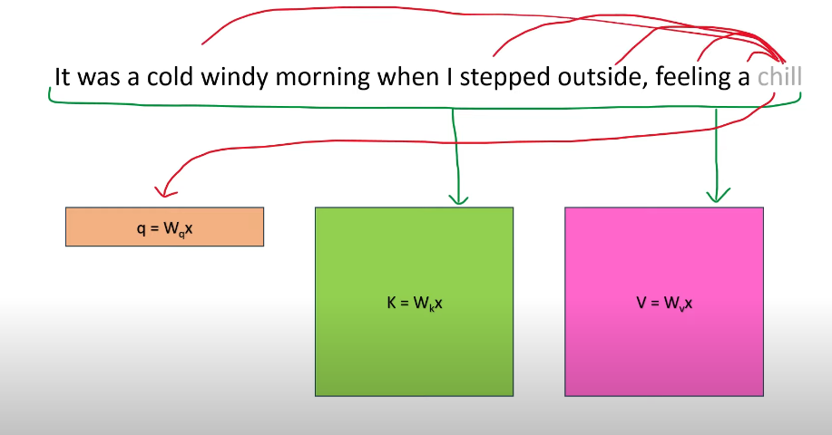
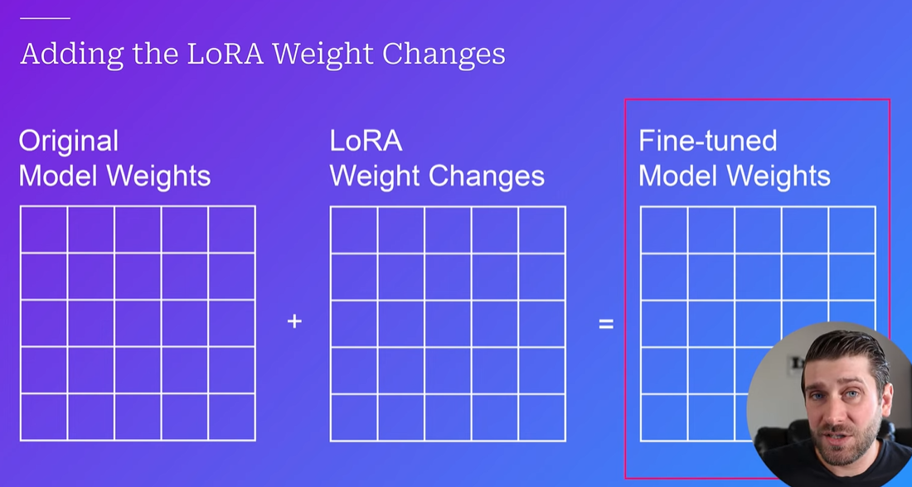

# ZtoNN Series

From Autor: 
- [nn-zero-to-hero/README](nn-zero-to-hero/README.md)
- [makemore/README](nn-zero-to-hero/lectures/makemore/makemore/README.md)
## 1st video: The spelled-out intro to neural networks and backpropagation: building micrograd
### Useful links
- *micrograd* on GitHub: https://github.com/karpathy/micrograd
- jupyter notebooks built in this video: 

> [!NOTE] Notebooks
> 1. [micrograd_lecture_first_half_roughly.ipynb](nn-zero-to-hero/lectures/micrograd/micrograd_lecture_first_half_roughly.ipynb)
> 2. [micrograd_lecture_second_half_roughly.ipynb](nn-zero-to-hero/lectures/micrograd/micrograd_lecture_second_half_roughly.ipynb)
> 

- From author
	- its a basic library which have the concept of neural networks.
	- it contain 2 main files: `engine` and `nn`:
	- `engine` file mainly contain all the mathematics to proceed with operations like backpropagation 
	- `nn` just fined the what neurons, layer and mlp (comb. of layers).
	- PyTorch and tensors are just pieces where we define to optimize the network and efficiency of whole modelling put together.

### Exercises: 
you should now be able to complete the following google collab, good luck!: [https://colab.research.google.com/dri...](https://www.youtube.com/redirect?event=video_description&redir_token=QUFFLUhqbXBBSHZ6aE14SXgwQlIxUDh4Um9VV0dLRU10QXxBQ3Jtc0ttVVZCaFlnZXNkaTVRVHp4M05uakhHOFFnWktleHVWSnU2VXQzQzc3aVJsc1NkSmFGNms4U2FfQ0NmcmszUnZSSzZGYVdSWDJ4VkJqZm1Dc2JBekFBRlc2cnJ2TVg1RGhBYlpnRFRWb2M2djNtVlE0RQ&q=https%3A%2F%2Fcolab.research.google.com%2Fdrive%2F1FPTx1RXtBfc4MaTkf7viZZD4U2F9gtKN%3Fusp%3Dsharing&v=VMj-3S1tku0)

### Sequence:
##1
Chapters: [00:00:00](https://www.youtube.com/watch?v=VMj-3S1tku0&list=PLAqhIrjkxbuWI23v9cThsA9GvCAUhRvKZ&index=1&t=0s)
intro [00:00:25](https://www.youtube.com/watch?v=VMj-3S1tku0&list=PLAqhIrjkxbuWI23v9cThsA9GvCAUhRvKZ&index=1&t=25s) 
micrograd overview [00:08:08](https://www.youtube.com/watch?v=VMj-3S1tku0&list=PLAqhIrjkxbuWI23v9cThsA9GvCAUhRvKZ&index=1&t=488s) 
derivative of a simple function with one input [00:14:12](https://www.youtube.com/watch?v=VMj-3S1tku0&list=PLAqhIrjkxbuWI23v9cThsA9GvCAUhRvKZ&index=1&t=852s) 
derivative of a function with multiple inputs [00:19:09](https://www.youtube.com/watch?v=VMj-3S1tku0&list=PLAqhIrjkxbuWI23v9cThsA9GvCAUhRvKZ&index=1&t=1149s) 
starting the core Value object of micrograd and its visualization [00:32:10](https://www.youtube.com/watch?v=VMj-3S1tku0&list=PLAqhIrjkxbuWI23v9cThsA9GvCAUhRvKZ&index=1&t=1930s) 
manual backpropagation example #1: simple expression [00:51:10](https://www.youtube.com/watch?v=VMj-3S1tku0&list=PLAqhIrjkxbuWI23v9cThsA9GvCAUhRvKZ&index=1&t=3070s) 
preview of a single optimization step [00:52:52](https://www.youtube.com/watch?v=VMj-3S1tku0&list=PLAqhIrjkxbuWI23v9cThsA9GvCAUhRvKZ&index=1&t=3172s) 
manual backpropagation example #2: a neuron [01:09:02](https://www.youtube.com/watch?v=VMj-3S1tku0&list=PLAqhIrjkxbuWI23v9cThsA9GvCAUhRvKZ&index=1&t=4142s)
implementing the backward function for each operation [01:17:32](https://www.youtube.com/watch?v=VMj-3S1tku0&list=PLAqhIrjkxbuWI23v9cThsA9GvCAUhRvKZ&index=1&t=4652s) 
implementing the backward function for a whole expression graph [01:22:28](https://www.youtube.com/watch?v=VMj-3S1tku0&list=PLAqhIrjkxbuWI23v9cThsA9GvCAUhRvKZ&index=1&t=4948s) 
fixing a backprop bug when one node is used multiple times [01:27:05](https://www.youtube.com/watch?v=VMj-3S1tku0&list=PLAqhIrjkxbuWI23v9cThsA9GvCAUhRvKZ&index=1&t=5225s) 

##2
breaking up a tanh, exercising with more operations [01:39:31](https://www.youtube.com/watch?v=VMj-3S1tku0&list=PLAqhIrjkxbuWI23v9cThsA9GvCAUhRvKZ&index=1&t=5971s) 
doing the same thing but in PyTorch: comparison [01:43:55](https://www.youtube.com/watch?v=VMj-3S1tku0&list=PLAqhIrjkxbuWI23v9cThsA9GvCAUhRvKZ&index=1&t=6235s) 
building out a neural net library (multi-layer perceptron) in micrograd [01:51:04](https://www.youtube.com/watch?v=VMj-3S1tku0&list=PLAqhIrjkxbuWI23v9cThsA9GvCAUhRvKZ&index=1&t=6664s) 
creating a tiny dataset, writing the loss function [01:57:56](https://www.youtube.com/watch?v=VMj-3S1tku0&list=PLAqhIrjkxbuWI23v9cThsA9GvCAUhRvKZ&index=1&t=7076s) 
collecting all of the parameters of the neural net [02:01:12](https://www.youtube.com/watch?v=VMj-3S1tku0&list=PLAqhIrjkxbuWI23v9cThsA9GvCAUhRvKZ&index=1&t=7272s) 
doing gradient descent optimization manually, training the network [02:14:03](https://www.youtube.com/watch?v=VMj-3S1tku0&list=PLAqhIrjkxbuWI23v9cThsA9GvCAUhRvKZ&index=1&t=8043s) 
summary of what we learned, how to go towards modern neural nets [02:16:46](https://www.youtube.com/watch?v=VMj-3S1tku0&list=PLAqhIrjkxbuWI23v9cThsA9GvCAUhRvKZ&index=1&t=8206s) 
walkthrough of the full code of micrograd on github [02:21:10](https://www.youtube.com/watch?v=VMj-3S1tku0&list=PLAqhIrjkxbuWI23v9cThsA9GvCAUhRvKZ&index=1&t=8470s) 
real stuff: diving into PyTorch, finding their backward pass for tanh [02:24:39](https://www.youtube.com/watch?v=VMj-3S1tku0&list=PLAqhIrjkxbuWI23v9cThsA9GvCAUhRvKZ&index=1&t=8679s) 
conclusion [02:25:20](https://www.youtube.com/watch?v=VMj-3S1tku0&list=PLAqhIrjkxbuWI23v9cThsA9GvCAUhRvKZ&index=1&t=8720s) 
outtakes :)

## 2nd video:  The spelled-out intro to language modeling: building makemore

- language level language model
- covered :
	-  Bigram (one character predicts the next one with a lookup table of counts)

> [!NOTE] Notebooks
> 1. [makemore_part1_bigrams.ipynb](nn-zero-to-hero/lectures/makemore/makemore_part1_bigrams.ipynb) 

- From Author:
- We implement a bigram character-level language model, which we will further complexify in follow-up videos into a modern Transformer language model, like GPT. In this video, the focus is on
	- (1) introducing torch.Tensor and its subtleties and use in efficiently evaluating neural networks .
	- (2) the overall framework of language modeling that includes model training, sampling, and the evaluation of a loss (e.g. the negative log likelihood for classification). Links:

### Useful links for practice:

- Python + Numpy tutorial from CS231n [https://cs231n.github.io/python-numpy...](https://www.youtube.com/redirect?event=video_description&redir_token=QUFFLUhqbWxMRXhzTU5FZ2toR0d3UTBxOHBqb3MtRFI3d3xBQ3Jtc0ttdVFrRVhfLXRNX185VWIxcDVfUEtxb3ZGa1F2MTMta2dNT0NZazJwYVdVbHdPNHQ3Q3lZVndOTVBiOUJPQnJUZzUyZU5QQWxqcGxKZWlwd1d3N3JrSlV0MTUyUGNUeHc2S0puaVJybEtVbW9TMl9lQQ&q=https%3A%2F%2Fcs231n.github.io%2Fpython-numpy-tutorial%2F&v=PaCmpygFfXo) . We use torch.tensor instead of numpy.array in this video. Their design (e.g. broadcasting, data types, etc.) is so similar that practicing one is basically practicing the other, just be careful with some of the APIs - how various functions are named, what arguments they take, etc. - these details can vary.
- PyTorch tutorial on Tensor https://pytorch.org/tutorials/beginner/basics/tensorqs_tutorial.html
- Another PyTorch intro to Tensor https://pytorch.org/tutorials/beginner/nlp/pytorch_tutorial.html

### Exercises: 
- **E01**: train a trigram language model, i.e. take two characters as an input to predict the 3rd one. Feel free to use either counting or a neural net. Evaluate the loss; Did it improve over a bigram model? 
- **E02**: split up the dataset randomly into 80% train set, 10% dev set, 10% test set. Train the bigram and trigram models only on the training set. Evaluate them on dev and test splits. What can you see? 
- **E03**: use the dev set to tune the strength of smoothing (or regularization) for the trigram model - i.e. try many possibilities and see which one works best based on the dev set loss. What patterns can you see in the train and dev set loss as you tune this strength? Take the best setting of the smoothing and evaluate on the test set once and at the end. How good of a loss do you achieve? 
- **E04**: we saw that our 1-hot vectors merely select a row of W, so producing these vectors explicitly feels wasteful. Can you delete our use of F.one_hot in favor of simply indexing into rows of W? 
- **E05**: look up and use F.cross_entropy instead. You should achieve the same result. Can you think of why we'd prefer to use F.cross_entropy instead? 
- **E06**: meta-exercise! Think of a fun/interesting exercise and complete it.

### Sequence 

[00:00:00](https://www.youtube.com/watch?v=PaCmpygFfXo&list=PLAqhIrjkxbuWI23v9cThsA9GvCAUhRvKZ&index=2&t=0s) intro 
[00:03:03](https://www.youtube.com/watch?v=PaCmpygFfXo&list=PLAqhIrjkxbuWI23v9cThsA9GvCAUhRvKZ&index=2&t=183s) reading and exploring the dataset 
[00:06:24](https://www.youtube.com/watch?v=PaCmpygFfXo&list=PLAqhIrjkxbuWI23v9cThsA9GvCAUhRvKZ&index=2&t=384s) exploring the bigrams in the dataset
[00:09:24](https://www.youtube.com/watch?v=PaCmpygFfXo&list=PLAqhIrjkxbuWI23v9cThsA9GvCAUhRvKZ&index=2&t=564s) counting bigrams in a python dictionary 
[00:12:45](https://www.youtube.com/watch?v=PaCmpygFfXo&list=PLAqhIrjkxbuWI23v9cThsA9GvCAUhRvKZ&index=2&t=765s) counting bigrams in a 2D torch tensor ("training the model")
[00:18:19](https://www.youtube.com/watch?v=PaCmpygFfXo&list=PLAqhIrjkxbuWI23v9cThsA9GvCAUhRvKZ&index=2&t=1099s) visualizing the bigram tensor 
[00:20:54](https://www.youtube.com/watch?v=PaCmpygFfXo&list=PLAqhIrjkxbuWI23v9cThsA9GvCAUhRvKZ&index=2&t=1254s) deleting spurious (S) and (E) tokens in favor of a single . token 
[00:24:02](https://www.youtube.com/watch?v=PaCmpygFfXo&list=PLAqhIrjkxbuWI23v9cThsA9GvCAUhRvKZ&index=2&t=1442s) sampling from the model
[00:36:17](https://www.youtube.com/watch?v=PaCmpygFfXo&list=PLAqhIrjkxbuWI23v9cThsA9GvCAUhRvKZ&index=2&t=2177s) efficiency! vectorized normalization of the rows, tensor broadcasting 
[00:50:14](https://www.youtube.com/watch?v=PaCmpygFfXo&list=PLAqhIrjkxbuWI23v9cThsA9GvCAUhRvKZ&index=2&t=3014s) loss function (the negative log likelihood of the data under our model) 
[01:00:50](https://www.youtube.com/watch?v=PaCmpygFfXo&list=PLAqhIrjkxbuWI23v9cThsA9GvCAUhRvKZ&index=2&t=3650s) model smoothing with fake counts 
[01:02:57](https://www.youtube.com/watch?v=PaCmpygFfXo&list=PLAqhIrjkxbuWI23v9cThsA9GvCAUhRvKZ&index=2&t=3777s) PART 2: the neural network approach: intro 
[01:05:26](https://www.youtube.com/watch?v=PaCmpygFfXo&list=PLAqhIrjkxbuWI23v9cThsA9GvCAUhRvKZ&index=2&t=3926s) creating the bigram dataset for the neural net 
[01:10:01](https://www.youtube.com/watch?v=PaCmpygFfXo&list=PLAqhIrjkxbuWI23v9cThsA9GvCAUhRvKZ&index=2&t=4201s) feeding integers into neural nets? one-hot encodings 
[01:13:53](https://www.youtube.com/watch?v=PaCmpygFfXo&list=PLAqhIrjkxbuWI23v9cThsA9GvCAUhRvKZ&index=2&t=4433s) the "neural net": one linear layer of neurons implemented with matrix multiplication 
[01:18:46](https://www.youtube.com/watch?v=PaCmpygFfXo&list=PLAqhIrjkxbuWI23v9cThsA9GvCAUhRvKZ&index=2&t=4726s) transforming neural net outputs into probabilities: the softmax 
[01:26:17](https://www.youtube.com/watch?v=PaCmpygFfXo&list=PLAqhIrjkxbuWI23v9cThsA9GvCAUhRvKZ&index=2&t=5177s) summary, preview to next steps, reference to micrograd 
[01:35:49](https://www.youtube.com/watch?v=PaCmpygFfXo&list=PLAqhIrjkxbuWI23v9cThsA9GvCAUhRvKZ&index=2&t=5749s) vectorized loss 
[01:38:36](https://www.youtube.com/watch?v=PaCmpygFfXo&list=PLAqhIrjkxbuWI23v9cThsA9GvCAUhRvKZ&index=2&t=5916s) backward and update, in PyTorch 
[01:42:55](https://www.youtube.com/watch?v=PaCmpygFfXo&list=PLAqhIrjkxbuWI23v9cThsA9GvCAUhRvKZ&index=2&t=6175s) putting everything together
[01:47:49](https://www.youtube.com/watch?v=PaCmpygFfXo&list=PLAqhIrjkxbuWI23v9cThsA9GvCAUhRvKZ&index=2&t=6469s) note 1: one-hot encoding really just selects a row of the next Linear layer's weight matrix [01:50:18](https://www.youtube.com/watch?v=PaCmpygFfXo&list=PLAqhIrjkxbuWI23v9cThsA9GvCAUhRvKZ&index=2&t=6618s) note 2: model smoothing as regularization loss 
[01:54:31](https://www.youtube.com/watch?v=PaCmpygFfXo&list=PLAqhIrjkxbuWI23v9cThsA9GvCAUhRvKZ&index=2&t=6871s) sampling from the neural net 
[01:56:16](https://www.youtube.com/watch?v=PaCmpygFfXo&list=PLAqhIrjkxbuWI23v9cThsA9GvCAUhRvKZ&index=2&t=6976s) conclusion

## 3rd video: Building makemore Part 2: MLP

> [!NOTE] Notebooks
> 1. [makemore_part2_mlp.ipynb](nn-zero-to-hero/lectures/makemore/makemore_part2_mlp.ipynb)
> 2. [a-neural-probabilistic-lang-model-bengio03a](nn-zero-to-hero/lectures/3.a-neural-probabilistic-lang-model-bengio03a.pdf)

### Useful links:

- PyTorch internals ref [http://blog.ezyang.com/2019/05/pytorc...](https://www.youtube.com/redirect?event=video_description&redir_token=QUFFLUhqbU5MbW5nQ053SnFkeGNfT091c3R0YXBCNnlOUXxBQ3Jtc0tsNFZyNVhYa3pzaUFnb3pVS0UwV2NSTlpyWUlGOEZrYWZfN2JtNDVBamdIQUVjLWFIYndmZ1o0ZzRyU04yS3R4ejc2V2RJdlJKN2hwbTRhQTZrM2gyTjNPMjVLbXJPcWQyMnY4NVZyaDVjNGFMaS1MZw&q=http%3A%2F%2Fblog.ezyang.com%2F2019%2F05%2Fpytorch-internals%2F&v=TCH_1BHY58I)

### Exercises:

- **E01**: Tune the hyperparameters of the training to beat my best validation loss of 2.2
- **E02**: I was not careful with the initialization of the network in this video. 
	- (1) What is the loss you'd get if the predicted probabilities at initialization were perfectly uniform? What loss do we achieve? 
	- (2) Can you tune the initialization to get a starting loss that is much more similar to (1)?
- **E03**: Read the Bengio et al 2003 paper (link above), implement and try any idea from the paper. Did it work?

### Sequence:
[00:00:00](https://www.youtube.com/watch?v=TCH_1BHY58I&list=PLAqhIrjkxbuWI23v9cThsA9GvCAUhRvKZ&index=3&t=0s) intro
[00:01:48](https://www.youtube.com/watch?v=TCH_1BHY58I&list=PLAqhIrjkxbuWI23v9cThsA9GvCAUhRvKZ&index=3&t=108s) Bengio et al. 2003 (MLP language model) paper walkthrough
[00:09:03](https://www.youtube.com/watch?v=TCH_1BHY58I&list=PLAqhIrjkxbuWI23v9cThsA9GvCAUhRvKZ&index=3&t=543s) (re-)building our training dataset 
[00:12:19](https://www.youtube.com/watch?v=TCH_1BHY58I&list=PLAqhIrjkxbuWI23v9cThsA9GvCAUhRvKZ&index=3&t=739s) implementing the embedding lookup table 
[00:18:35](https://www.youtube.com/watch?v=TCH_1BHY58I&list=PLAqhIrjkxbuWI23v9cThsA9GvCAUhRvKZ&index=3&t=1115s) implementing the hidden layer + internals of torch.Tensor: storage, views 
[00:29:15](https://www.youtube.com/watch?v=TCH_1BHY58I&list=PLAqhIrjkxbuWI23v9cThsA9GvCAUhRvKZ&index=3&t=1755s) implementing the output layer 
[00:29:53](https://www.youtube.com/watch?v=TCH_1BHY58I&list=PLAqhIrjkxbuWI23v9cThsA9GvCAUhRvKZ&index=3&t=1793s) implementing the negative log likelihood loss 
[00:32:17](https://www.youtube.com/watch?v=TCH_1BHY58I&list=PLAqhIrjkxbuWI23v9cThsA9GvCAUhRvKZ&index=3&t=1937s) summary of the full network 
[00:32:49](https://www.youtube.com/watch?v=TCH_1BHY58I&list=PLAqhIrjkxbuWI23v9cThsA9GvCAUhRvKZ&index=3&t=1969s) introducing F.cross_entropy and why 
[00:37:56](https://www.youtube.com/watch?v=TCH_1BHY58I&list=PLAqhIrjkxbuWI23v9cThsA9GvCAUhRvKZ&index=3&t=2276s) implementing the training loop, overfitting one batch 
[00:41:25](https://www.youtube.com/watch?v=TCH_1BHY58I&list=PLAqhIrjkxbuWI23v9cThsA9GvCAUhRvKZ&index=3&t=2485s) training on the full dataset, minibatches 
[00:45:40](https://www.youtube.com/watch?v=TCH_1BHY58I&list=PLAqhIrjkxbuWI23v9cThsA9GvCAUhRvKZ&index=3&t=2740s) finding a good initial learning rate 
[00:53:20](https://www.youtube.com/watch?v=TCH_1BHY58I&list=PLAqhIrjkxbuWI23v9cThsA9GvCAUhRvKZ&index=3&t=3200s) splitting up the dataset into train/val/test splits and why 
[01:00:49](https://www.youtube.com/watch?v=TCH_1BHY58I&list=PLAqhIrjkxbuWI23v9cThsA9GvCAUhRvKZ&index=3&t=3649s) experiment: larger hidden layer
[01:05:27](https://www.youtube.com/watch?v=TCH_1BHY58I&list=PLAqhIrjkxbuWI23v9cThsA9GvCAUhRvKZ&index=3&t=3927s) visualizing the character embeddings 
[01:07:16](https://www.youtube.com/watch?v=TCH_1BHY58I&list=PLAqhIrjkxbuWI23v9cThsA9GvCAUhRvKZ&index=3&t=4036s) experiment: larger embedding size 
[01:11:46](https://www.youtube.com/watch?v=TCH_1BHY58I&list=PLAqhIrjkxbuWI23v9cThsA9GvCAUhRvKZ&index=3&t=4306s) summary of our final code, conclusion
[01:13:24](https://www.youtube.com/watch?v=TCH_1BHY58I&list=PLAqhIrjkxbuWI23v9cThsA9GvCAUhRvKZ&index=3&t=4404s) sampling from the model 
[01:14:55](https://www.youtube.com/watch?v=TCH_1BHY58I&list=PLAqhIrjkxbuWI23v9cThsA9GvCAUhRvKZ&index=3&t=4495s) google collab (new!!) notebook advertisement

## 4th Video: Building makemore Part 3: Activations & Gradients, BatchNorm

> [!NOTE] Notebooks
> 1. [makemore_part3_bn.ipynb](nn-zero-to-hero/lectures/makemore/makemore_part3_bn.ipynb)
> 1a. [makemore_part3_bn_notes.ipynb](nn-zero-to-hero/lectures/makemore/makemore_part3_bn_notes.ipynb)
> 1b. Uploaded on drive - [Link](https://drive.google.com/drive/folders/1qgD_ijEKLsl4kxNQEQ6YbpLKsO4jbRNd)
> 1. [a-neural-probabilistic-lang-model-bengio03a](nn-zero-to-hero/lectures/3.a-neural-probabilistic-lang-model-bengio03a.pdf)
> 2. [3.1.delving deep into rectifiers to deal with initialization of paramaters on network](nn-zero-to-hero/lectures/3.1.delving%20deep%20into%20rectifiers%20to%20deal%20with%20initialization%20of%20paramaters%20on%20network.pdf)
> 	1. [3.1.AlexNet-NIPS-2012-imagenet-classification-with-deep-convolutional-neural-networks-Paper](nn-zero-to-hero/lectures/3.1.AlexNet-NIPS-2012-imagenet-classification-with-deep-convolutional-neural-networks-Paper.pdf)
> 	2. [3.1.vgg-very-deep-convolutional-networks-for-large-scale-image-recognition](nn-zero-to-hero/lectures/3.1.vgg-very-deep-convolutional-networks-for-large-scale-image-recognition.pdf)
> 3. [3.2-rethinking-batch-in-BatchNorm](nn-zero-to-hero/lectures/3.2-rethinking-batch-in-BatchNorm.pdf)
> 4. [3.3-batch-normalization-deep-nueral-networks](nn-zero-to-hero/lectures/3.3-batch-normalization-deep-nueral-networks.pdf)

### Useful links: 
- "Kaiming init" paper: [https://arxiv.org/abs/1502.01852](https://www.youtube.com/redirect?event=video_description&redir_token=QUFFLUhqbmpIQ0l2UFZ4MFdMSEZvNTRHZGFDMll0b05KUXxBQ3Jtc0traEJGcmtyeUdpNWxLODZOZ1ZPNmlDZU4wQUNrSHphNUNzUzl0ZjY3cUVSNDgxX1Rlb2hVYlhKaWlqdm5zM3FxZk9taDBSMmNXdTZ2em5OT05aQW5wb0lRNTlIaDRJTlVtb0x4Y21CLXNNbHhRWmZlSQ&q=https%3A%2F%2Farxiv.org%2Fabs%2F1502.01852&v=P6sfmUTpUmc)
- BatchNorm paper: [https://arxiv.org/abs/1502.03167](https://www.youtube.com/redirect?event=video_description&redir_token=QUFFLUhqa0FQc0VlZHFLenIwaGxRdkZ4RHFCOGhIMjVOZ3xBQ3Jtc0tsdXFORU94UWpseUVVbkd1UFBFekptYnBsc1J1MHZ1SWI2VVQ1ODlnLWJuZTJWLUlQTHpqaWFoZXBvb2dBdHRpODJXTUVEMjRMSWdvcGxIVk5ITTlabVo3bjBiQ3hoVG9EWWN2NUFtMzhlXzRiZjE0Yw&q=https%3A%2F%2Farxiv.org%2Fabs%2F1502.03167&v=P6sfmUTpUmc)
- Bengio et al. 2003 MLP language model paper (pdf): [https://www.jmlr.org/papers/volume3/b...](https://www.youtube.com/redirect?event=video_description&redir_token=QUFFLUhqbFlzU003RmtlaXpyaTExa01seVAzOGUyUHQ1QXxBQ3Jtc0ttaTVxY1ZESFZIbFJDU18xemxCUDA4XzFMb3ZBTUdmdlZjc3h5N3FNRm5NM1UzemJTQ2NuMDdkaGJ4OVB2d0RtRldvcy1xYlFiZ1JiS1VRWmlzNXhQZnpYSU5yRHU0Qm5PNk5yZDNfSzdSSGRwWTRjMA&q=https%3A%2F%2Fwww.jmlr.org%2Fpapers%2Fvolume3%2Fbengio03a%2Fbengio03a.pdf&v=P6sfmUTpUmc)
- Good paper illustrating some of the problems with batchnorm in practice: [https://arxiv.org/abs/2105.07576](https://www.youtube.com/redirect?event=video_description&redir_token=QUFFLUhqbGc1WUJUVy14WnVRWUdUdldJUS1mNjlsZWJZUXxBQ3Jtc0ttNkI4a21KR1Y0SGtQZG9samFzQWNpeVVwcXNqQUVXa0t5LWlMVGt2a2VhdlZyUFIyckR6MWV6LTVvRlFTTlJUZGhyc2NzNDJ3dnZ0NllLMURHRmpJbmxmYTNtT0EwYk5DOTE0OW1ZaEhCMkdsRlY5RQ&q=https%3A%2F%2Farxiv.org%2Fabs%2F2105.07576&v=P6sfmUTpUmc)
- Restnet code in pytorch models https://github.com/pytorch/vision/blob/main/torchvision/models/resnet.py 

Exercises:

- **E01**: I did not get around to seeing what happens when you initialize all weights and biases to zero. Try this and train the neural net. You might think either that 1) the network trains just fine or 2) the network doesn't train at all, but actually it is 3) the network trains but only partially, and achieves a pretty bad final performance. Inspect the gradients and activations to figure out what is happening and why the network is only partially training, and what part is being trained exactly.
- **E02**: BatchNorm, unlike other normalization layers like LayerNorm/GroupNorm etc. has the big advantage that after training, the batchnorm gamma/beta can be "folded into" the weights of the preceeding Linear layers, effectively erasing the need to forward it at test time. Set up a small 3-layer MLP with batchnorms, train the network, then "fold" the batchnorm gamma/beta into the preceeding Linear layer's W,b by creating a new W2, b2 and erasing the batch norm. Verify that this gives the same forward pass during inference. i.e. we see that the batchnorm is there just for stabilizing the training, and can be thrown out after training is done! pretty cool.

### Sequence:

 intro [00:01:22](https://www.youtube.com/watch?v=P6sfmUTpUmc&list=PLAqhIrjkxbuWI23v9cThsA9GvCAUhRvKZ&index=4&t=82s) 
 starter code [00:04:19](https://www.youtube.com/watch?v=P6sfmUTpUmc&list=PLAqhIrjkxbuWI23v9cThsA9GvCAUhRvKZ&index=4&t=259s) 
 fixing the initial loss [00:12:59](https://www.youtube.com/watch?v=P6sfmUTpUmc&list=PLAqhIrjkxbuWI23v9cThsA9GvCAUhRvKZ&index=4&t=779s) 
 fixing the saturated tanh [00:27:53](https://www.youtube.com/watch?v=P6sfmUTpUmc&list=PLAqhIrjkxbuWI23v9cThsA9GvCAUhRvKZ&index=4&t=1673s) 
 calculating the init scale: “Kaiming init” [00:40:40](https://www.youtube.com/watch?v=P6sfmUTpUmc&list=PLAqhIrjkxbuWI23v9cThsA9GvCAUhRvKZ&index=4&t=2440s) 
 batch normalization [01:03:07](https://www.youtube.com/watch?v=P6sfmUTpUmc&list=PLAqhIrjkxbuWI23v9cThsA9GvCAUhRvKZ&index=4&t=3787s) 
 batch normalization: summary [01:04:50](https://www.youtube.com/watch?v=P6sfmUTpUmc&list=PLAqhIrjkxbuWI23v9cThsA9GvCAUhRvKZ&index=4&t=3890s) 
 real example: resnet50 walkthrough [01:14:10](https://www.youtube.com/watch?v=P6sfmUTpUmc&list=PLAqhIrjkxbuWI23v9cThsA9GvCAUhRvKZ&index=4&t=4450s) 
 summary of the lecture [01:18:35](https://www.youtube.com/watch?v=P6sfmUTpUmc&list=PLAqhIrjkxbuWI23v9cThsA9GvCAUhRvKZ&index=4&t=4715s) 
 just kidding: part2: PyTorch-ifying the code [01:26:51](https://www.youtube.com/watch?v=P6sfmUTpUmc&list=PLAqhIrjkxbuWI23v9cThsA9GvCAUhRvKZ&index=4&t=5211s) 
 viz #1: forward pass activations statistics [01:30:54](https://www.youtube.com/watch?v=P6sfmUTpUmc&list=PLAqhIrjkxbuWI23v9cThsA9GvCAUhRvKZ&index=4&t=5454s) 
 viz #2: backward pass gradient statistics [01:32:07](https://www.youtube.com/watch?v=P6sfmUTpUmc&list=PLAqhIrjkxbuWI23v9cThsA9GvCAUhRvKZ&index=4&t=5527s) 
 the fully linear case of no non-linearities [01:36:15](https://www.youtube.com/watch?v=P6sfmUTpUmc&list=PLAqhIrjkxbuWI23v9cThsA9GvCAUhRvKZ&index=4&t=5775s) 
 viz #3: parameter activation and gradient statistics [01:39:55](https://www.youtube.com/watch?v=P6sfmUTpUmc&list=PLAqhIrjkxbuWI23v9cThsA9GvCAUhRvKZ&index=4&t=5995s) 
 viz #4: update: data ratio over time [01:46:04](https://www.youtube.com/watch?v=P6sfmUTpUmc&list=PLAqhIrjkxbuWI23v9cThsA9GvCAUhRvKZ&index=4&t=6364s) 
 bringing back batchnorm, looking at the visualizations [01:51:34](https://www.youtube.com/watch?v=P6sfmUTpUmc&list=PLAqhIrjkxbuWI23v9cThsA9GvCAUhRvKZ&index=4&t=6694s) 
 summary of the lecture for real this time

## 5th Video: Building makemore Part 4: Becoming a Backprop Ninja

We take the 2-layer MLP (with BatchNorm) from the previous video and backpropagate through it manually without using PyTorch autograd's loss.backward(): through the cross entropy loss, 2nd linear layer, tanh, batchnorm, 1st linear layer, and the embedding table. Along the way, we get a strong intuitive understanding about how gradients flow backwards through the compute graph and on the level of efficient Tensors, not just individual scalars like in micrograd. This helps build competence and intuition around how neural nets are optimized and sets you up to more confidently innovate on and debug modern neural networks.

### Useful links: 
- Yes you should understand backprop:   [medium/ yes-you-should-understand-backprop](https://www.youtube.com/redirect?event=video_description&redir_token=QUFFLUhqbFNFZVlQeVQ5eGxpeGRkQUlVMDk1MERMZndrQXxBQ3Jtc0trNWJIS3Jsb0FRaE5LQWwtVGhock1KNEdYQmVnWUJoaFFST1ZneC1tZU9MZ0xjem1Oc2ljcnNXbnJMX2FPdzRBb0tkUlB1dDhjSG10WXhTeWRqT1ZqQVgxUmItSmdQNDhMWXlwS0VIejhzaWFEXzI4QQ&q=https%3A%2F%2Fkarpathy.medium.com%2Fyes-you-should-understand-backprop-e2f06eab496b&v=q8SA3rM6ckI)  
- BatchNorm paper: [https://arxiv.org/abs/1502.03167](https://www.youtube.com/redirect?event=video_description&redir_token=QUFFLUhqa2NSMmVXTjFGYkIyYzd3N3FzdkVtTWtXc1AyUXxBQ3Jtc0ttbEV1WlBuMmgyc2dWOFdoSXpTcU5RNlJGODBheTFBRUVNMVBvRU5xRnR4V2tabDZBZW1NYlRKOE9WZnBUTGdBVzRtWGZiTFhRX3doU25LM1RZTjhCUklJd0FRQnl2dDNrSk5aM0Z2UWFyOXcwMGpsOA&q=https%3A%2F%2Farxiv.org%2Fabs%2F1502.03167&v=q8SA3rM6ckI)
- Bessel’s Correction: [http://math.oxford.emory.edu/site/mat...](https://www.youtube.com/redirect?event=video_description&redir_token=QUFFLUhqbFoybGRwejJhTkNUbFpKbHRXaC1PUHBzM2tNd3xBQ3Jtc0ttNWhXNWwyY1h5ZFU3bkVRQWRmcTRSZDBIcjcwdGVaRmlsQmpXMWI3amlsbkZfaGhtUXNzWWlpMHVwVXRCRXpzVEZYT2J5bUd6ejJaQ2Mxa3RQeDZuS2twSU4zZTl2ZzZjajBNNFFVQTBrdWRhX0kxQQ&q=http%3A%2F%2Fmath.oxford.emory.edu%2Fsite%2Fmath117%2FbesselCorrection%2F&v=q8SA3rM6ckI)
- Bengio et al. 2003 MLP LM [https://www.jmlr.org/papers/volume3/b...](https://www.youtube.com/redirect?event=video_description&redir_token=QUFFLUhqbEZqNWFWbDhKZnVNc1FDZVpFQWpWd2UzYUEwUXxBQ3Jtc0tuWnNkVjVXMUF2MlFvWHBKZmlBUGZfeFd0SW93bHk5ZXBKYnpremJwODlYWUROaU4yTlpBbFRWUlNmZEFFdVUtZ2lyTU5XNjZONVBzR0puaG0xYWRvSXNwZG5yYzBIZzFRODg0enl0Tm54OXgwQjFsaw&q=https%3A%2F%2Fwww.jmlr.org%2Fpapers%2Fvolume3%2Fbengio03a%2Fbengio03a.pdf&v=q8SA3rM6ckI)

### Sequence:
 - [00:00:00](https://www.youtube.com/watch?v=q8SA3rM6ckI&list=PLAqhIrjkxbuWI23v9cThsA9GvCAUhRvKZ&index=5&t=0s) intro: why you should care & fun history 
 - [00:07:26](https://www.youtube.com/watch?v=q8SA3rM6ckI&list=PLAqhIrjkxbuWI23v9cThsA9GvCAUhRvKZ&index=5&t=446s) starter code 
 - [00:13:01](https://www.youtube.com/watch?v=q8SA3rM6ckI&list=PLAqhIrjkxbuWI23v9cThsA9GvCAUhRvKZ&index=5&t=781s) exercise 1: backproping the atomic compute graph 
 - [01:05:17](https://www.youtube.com/watch?v=q8SA3rM6ckI&list=PLAqhIrjkxbuWI23v9cThsA9GvCAUhRvKZ&index=5&t=3917s) brief digression: bessel’s correction in batchnorm 
 - [01:26:31](https://www.youtube.com/watch?v=q8SA3rM6ckI&list=PLAqhIrjkxbuWI23v9cThsA9GvCAUhRvKZ&index=5&t=5191s) exercise 2: cross entropy loss backward pass 
 - [01:36:37](https://www.youtube.com/watch?v=q8SA3rM6ckI&list=PLAqhIrjkxbuWI23v9cThsA9GvCAUhRvKZ&index=5&t=5797s) exercise 3: batch norm layer backward pass 
 - [01:50:02](https://www.youtube.com/watch?v=q8SA3rM6ckI&list=PLAqhIrjkxbuWI23v9cThsA9GvCAUhRvKZ&index=5&t=6602s) exercise 4: putting it all together 
 - [01:54:24](https://www.youtube.com/watch?v=q8SA3rM6ckI&list=PLAqhIrjkxbuWI23v9cThsA9GvCAUhRvKZ&index=5&t=6864s) outro

## 6th video: Building makemore Part 5: Building WaveNet

We take the 2-layer MLP from previous video and make it deeper with a tree-like structure, arriving at a convolutional neural network architecture similar to the WaveNet (2016) from DeepMind. In the WaveNet paper, the same hierarchical architecture is implemented more efficiently using causal dilated convolutions (not yet covered). Along the way we get a better sense of torch.nn and what it is and how it works under the hood, and what a typical deep learning development process looks like (a lot of reading of documentation, keeping track of multidimensional tensor shapes, moving between jupyter notebooks and repository code, ...). Links:

- makemore on github: [https://github.com/karpathy/makemore](https://www.youtube.com/redirect?event=video_description&redir_token=QUFFLUhqazlZUnV4M0dlSS1OWVl5QTNqQV85cTh4Y25iQXxBQ3Jtc0tsYjVBN29ObWlHcm1JcW9mMmt6eVJRd0VKMTM3Xy1oSzJMUWpPSEpOVU04bUM1MUExODN6aGhqQXNiWjlIQnR0SGY3WDRmLVVZZGEtVjg4VEE2YlVuR1A0Qi1OY2dBZXl3TWg0WTlLekVCUk5jbWR0TQ&q=https%3A%2F%2Fgithub.com%2Fkarpathy%2Fmakemore&v=t3YJ5hKiMQ0)
- jupyter notebook I built in this video: [https://github.com/karpathy/nn-zero-t...](https://www.youtube.com/redirect?event=video_description&redir_token=QUFFLUhqbm04WFRKd3MzaFY1U1pRbEI2R3BTdUdHQjNjZ3xBQ3Jtc0tsQ0ZUeFJjZW1LbnU3QWFISjFKU1MwZVJDMmRxWFc5ZUJWam5leEdnc214Y2ZMaEdqTFl0bFVXcnlUdmpqNzd4SGdDSl95NF9zYlZ6WklHUzJtTVBJUmh3Z0xLMm9ORVJNb2MzQWZhSzREWmtqTXIwTQ&q=https%3A%2F%2Fgithub.com%2Fkarpathy%2Fnn-zero-to-hero%2Fblob%2Fmaster%2Flectures%2Fmakemore%2Fmakemore_part5_cnn1.ipynb&v=t3YJ5hKiMQ0)
- collab notebook: [https://colab.research.google.com/dri...](https://www.youtube.com/redirect?event=video_description&redir_token=QUFFLUhqbGdPS1AzTnRod3lIUjJiN1V6QlNScC1ZNGRkZ3xBQ3Jtc0tsUEloekZpUlB6dTRidUp6S01aNzE1RzRicHZXcTh2WFZMMXN4eThMZU1FWXF4ejF6aTY4RnFXMnFQZ1JQQkFDYjR5a3hMZmdWNExPMGNLcEFMa0cyYUtiaWt1MHc3dmtNalgwUkh2MjN0ZERaaUJsQQ&q=https%3A%2F%2Fcolab.research.google.com%2Fdrive%2F1CXVEmCO_7r7WYZGb5qnjfyxTvQa13g5X%3Fusp%3Dsharing&v=t3YJ5hKiMQ0)

### Useful links: 
- WaveNet 2016 from DeepMind [https://arxiv.org/abs/1609.03499](https://www.youtube.com/redirect?event=video_description&redir_token=QUFFLUhqbGFOY2NwMDVsYmE2RjlhdkxFNHhCTjF0b0x6d3xBQ3Jtc0tsejNYSm9JQmZGWkNKcV9DMUN5Qm45ZUk5Q2VGMXozVDVEYXExNVFnbmFXVWIweld0Q1U5bFBuR09uNm11XzJaTExydDdhR2U2R2dxNjkxQkNjZ0o5NlZEazFDTWpGTldLbTRFUTlWV3lqdXdOamd6Zw&q=https%3A%2F%2Farxiv.org%2Fabs%2F1609.03499&v=t3YJ5hKiMQ0)
- Bengio et al. 2003 MLP LM [https://www.jmlr.org/papers/volume3/b...](https://www.youtube.com/redirect?event=video_description&redir_token=QUFFLUhqbldPVzl6VHlZQ1dnanowdTIyc2RhZ016VTktUXxBQ3Jtc0tscjhnbVR2bHVqLTRVQ3RVRFJsLVR4TkNxRjliaU15dGpwVWw1T1ZhX0gzLWxYT2ZkS0w1dldQeFFMbkFTR2RNRWxheEN5OGRvNVVDQVEzZWRfOFo1ekcxVTlpb3FGTTRULTBOZHdSZklNVERxSjhqOA&q=https%3A%2F%2Fwww.jmlr.org%2Fpapers%2Fvolume3%2Fbengio03a%2Fbengio03a.pdf&v=t3YJ5hKiMQ0)

- [wavenet-a-generative-model-for-raw-audio](wavenet-a-generative-model-for-raw-audio.pdf)
- https://github.com/ibab/tensorflow-wavenet
- check PyTorch models documentation

## 7th video: Let's build GPT: from scratch, in code, spelled out.

We build a Generatively Pretrained Transformer (GPT), following the paper "Attention is All You Need" and OpenAI's GPT-2 / GPT-3. We talk about connections to ChatGPT, which has taken the world by storm. We watch GitHub Copilot, itself a GPT, help us write a GPT (meta :D!) . I recommend people watch the earlier makemore videos to get comfortable with the autoregressive language modeling framework and basics of tensors and PyTorch nn, which we take for granted in this video. Links:

- Google colab for the video: [https://colab.research.google.com/dri...](https://www.youtube.com/redirect?event=video_description&redir_token=QUFFLUhqa0dMS1VtWEtGSDR4bkY0ckZNN1d5WkxMbDQ0d3xBQ3Jtc0tuM2NhRDRwQmxBdi05MUFXVFEzdGdTekZBVUw0U2hEV3BxZGxRdENod1BuTjZPek00NmVyblZ2M2JWT3RVamhmYllkaEU0V2pUN29VQVpGa1U1LXFBb2xSbXJxSTkwbjBmdVY4LVZnVWhPZVZDeGdjaw&q=https%3A%2F%2Fcolab.research.google.com%2Fdrive%2F1JMLa53HDuA-i7ZBmqV7ZnA3c_fvtXnx-%3Fusp%3Dsharing&v=kCc8FmEb1nY)
- GitHub repo for the video: [https://github.com/karpathy/ng-video-...](https://www.youtube.com/redirect?event=video_description&redir_token=QUFFLUhqbXhnWUJyb3dyLS1melBmMnI2emtLdm50OFgtZ3xBQ3Jtc0tuRXpJMU4tYlBCNjk5UWRFTkZpdllMVjVBMUFYdUoyNHNQTHowd2FKc1NNQXR6SnZXbnVfTTFYQzFEMnJVSl96OUt2MXNTQVAxQVBqeGgyTnRNbnE3bnVHNWlkZi1oQVZVRlVZXzJONU5UTFJFMk9ITQ&q=https%3A%2F%2Fgithub.com%2Fkarpathy%2Fng-video-lecture&v=kCc8FmEb1nY)
- nanoGPT repo: [https://github.com/karpathy/nanoGPT](https://www.youtube.com/redirect?event=video_description&redir_token=QUFFLUhqbWFLY1BxQzlNcFA5UmpWZ2tkb0k5N3J0XzFsQXxBQ3Jtc0tsNFhGMW0xZXVhQXhJMlMyNVJiSVlLNmtkZ2pQd2UxXzNJRC1IX2hYSzk3Z1VGNzc2WHotbU56QWZEaUI4R2JLa0VHZGYzZVFjX2l6TW9ycEVVWm1MenZLU003WEZEY2oyNEFDVmdlT2d6bFFzSlFhdw&q=https%3A%2F%2Fgithub.com%2Fkarpathy%2FnanoGPT&v=kCc8FmEb1nY)

### Useful links: 
- Checkout notes on [GPT-Transformers](GPT-Transformer.md)
- Attention is All You Need paper: [PDF](nn-zero-to-hero/lectures/11.Attention-All-You-Need.pdf)
- OpenAI GPT-3 paper: [https://arxiv.org/abs/2005.14165](https://www.youtube.com/redirect?event=video_description&redir_token=QUFFLUhqa3Z4WklWUWV3dnRKVGNrX1RCS0JMMU1ET1Bld3xBQ3Jtc0ttSlR1a3NaellpelNkZlN1Sml0dmlXRDVTd1RQNHpwS003TTdnZ29JcTBBVkQ3M2hCVFV1WlpPVEJvYldKYXZUSnNBMldmQkdQSG52VlNWQ19Xd29LdGNDSXRnd3VWTllUbGpFaHZPdGFLQXRQTUUyUQ&q=https%3A%2F%2Farxiv.org%2Fabs%2F2005.14165&v=kCc8FmEb1nY)
- OpenAI ChatGPT blog post: [https://openai.com/blog/chatgpt/](https://www.youtube.com/redirect?event=video_description&redir_token=QUFFLUhqa2VUUDZISmVmbjBhaUppSThuVVVBNFZ2dlY1Z3xBQ3Jtc0tud2w0Mnc0N09zX3pieENkOGhvMFgzRTMxT3ZpVVptNzBkZTN0LVB0NVJpbUdfSzJ5N0xsMGVqdnB3R0pYLWVYNHlmN1RjWWh1amJjZlZhZnE3VjBRekE2LUNOakZQbDNCT1ozUzlzanZLN3pQT1JIQQ&q=https%3A%2F%2Fopenai.com%2Fblog%2Fchatgpt%2F&v=kCc8FmEb1nY)
- The GPU I'm training the model on is from Lambda GPU Cloud, I think the best and easiest way to spin up an on-demand GPU instance in the cloud that you can ssh to: [https://lambdalabs.com](https://www.youtube.com/redirect?event=video_description&redir_token=QUFFLUhqbXh1X1RxNGdHS0NGUnhxWUhiOHZHR1Zfc1hMd3xBQ3Jtc0tteGFQQTNBSXNHclBUVF9rc1pLWVJISGszUllpS1oyS2U2NF9VNWFTSDcwU2wxYjZyNElXYWRLQlh0SWplMDMteUNVbDFvdUxrNWdHRDhWUGZjYkZtaEVnOGtwbGNIRGZ3OEllSG8zdGdHRVRaLUFnWQ&q=https%3A%2F%2Flambdalabs.com%2F&v=kCc8FmEb1nY) . If you prefer to work in notebooks, I think the easiest path today is Google Colab.

### more things
- Types of Attention:
  - [**FlexAttention**: The Flexibility of PyTorch with the Performance of FlashAttention | PyTorch](https://pytorch.org/blog/flexattention/)

Suggested exercises:

- **EX1**: The n-dimensional tensor mastery challenge: Combine the `Head` and `MultiHeadAttention` into one class that processes all the heads in parallel, treating the heads as another batch dimension (answer is in nanoGPT).
- **EX2**: Train the GPT on your own dataset of choice! What other data could be fun to blabber on about? (A fun advanced suggestion if you like: train a GPT to do addition of two numbers, i.e. a+b=c. You may find it helpful to predict the digits of c in reverse order, as the typical addition algorithm (that you're hoping it learns) would proceed right to left too. You may want to modify the data loader to simply serve random problems and skip the generation of train.bin, val.bin. You may want to mask out the loss at the input positions of a+b that just specify the problem using y=-1 in the targets (see CrossEntropyLoss ignore_index). Does your Transformer learn to add? Once you have this, swole doge project: build a calculator clone in GPT, for all of +-*/. Not an easy problem. You may need Chain of Thought traces.)
- **EX3**: Find a dataset that is very large, so large that you can't see a gap between train and val loss. Pretrain the transformer on this data, then initialize with that model and finetune it on tiny shakespeare with a smaller number of steps and lower learning rate. Can you obtain a lower validation loss by the use of pretraining?
- **EX4**: Read some transformer papers and implement one additional feature or change that people seem to use. Does it improve the performance of your GPT?

## 8th video: State of GPT

- 

### Pretraining 
- 
- 
- 
-  
- 
- 
- 
  - this is  gpt 1
- 
  - prompting to the model without finetune
- 
- 
- 
- 

### Supervised fintune

- 
- 

### RHLF : Reinforcement Learning 

#### Reward Modelling
- 

#### RL
- 
- 
- 

### Pointers
- 
- 
- 
  - First three are RLHF
  - Remaining SFT models
- 
  - reasoning cannot be given to transformer it doesn't understand, need to provide more token to make it 
- 
- 
- 
- 
- 
- 
- 
- 
- 
- 
- 
- 
- 
- 
- 
- 
- 

### 8.A video: Introduction LLM models

- llama-2-70b:
	- 2nd iteration of series
	- 70billion model with biggest
	- open weights
	- chatgpt closed model
	- 2 files :
		- parameters: weights 
			- every parameters are stored as 2 bytes
			- 140GB
			- float16 number
		- run code for those parameters
			- c files
			- 500 line 
			- no dependencies
	-  Complexity
		- Training
		- inference doesn't requires much computation
		- while inference model hallocinate / dreaming the content in the form of webpage
		- some can be memorize or some might be wrong
	- Transformer architecture
		- 
	- the assistant training : finetuning
		- training in same way just using some labelling documentation data
		- high quality and low quantity
		- Q&A documents give assistant 
		- in fine tuning they get the format we it has seen the data 
		- but the knowledge is built using 1st stage training
		- 
	- 
	- 
	- Last updated: 2024-12-10.
	- https://huggingface.co/spaces/lmarena-ai/chatbot-arena-leaderboard  
	- accuracy of the model depends on two parts:
		- loss
		- parameters
		- well behave structure
		- 
	- capability
		- searching done by LLM
		- coding 
		- speech
		- vision /image generation
	- system 1 and system 2
		- system 2 is think: convert time to accuracy
	- Self improvement:
		- Alpha Go 2 stages:
			- learn by imitating expert human players
			- learn by self improvement (reward=win the game)
				- in the sandbox ienv
			- 
	- Custom LLM 
		- like GPT by chatgpt
		- like RAG using the docuemtn we upload 
		- in future uploading the data
	- 
	- 
	- jailbreaks :
		- tracking on getting 
		- 
		- llms are easy on **base64** can use to do jail break
		- 
		- 
		- 
		- 
		- 
		- 
		- 
- END

- The dreams and hallucinations do not get fixed with finetuning. 
	- Finetuning just "directs" the dreams into "helpful assistant dreams". 
	- Always be careful with what LLMs tell you, especially if they are telling you something from memory alone. 
	- That said, similar to a human, if the LLM used browsing or retrieval and the answer made its way into the "working memory" of its context window, you can trust the LLM a bit more to process that information into the final answer. 
	- But TLDR right now, do not trust what LLMs say or do. For example, in the tools section, I'd always recommend double-checking the math/code the LLM did.
- How does the LLM use a tool like the browser? 
	- It emits special words, e.g. |BROWSER|. When the code "above" that is inferencing the LLM detects these words it captures the output that follows, sends it off to a tool, comes back with the result and continues the generation. 
	- How does the LLM know to emit these special words? 
	- Finetuning datasets teach it how and when to browse, by example. And/or the instructions for tool use can also be automatically placed in the context window (in the “system message”).
- You might also enjoy my 2015 blog post "Unreasonable Effectiveness of Recurrent Neural Networks". 
	- The way we obtain base models today is pretty much identical on a high level, except the RNN is swapped for a Transformer. https://karpathy.github.io/2015/05/21/rnn-effectiveness/
- What is in the run.c file? A bit more full-featured 1000-line version hre: https://github.com/karpathy/llama2.c/blob/master/run.c 

## 9th video: GPT Tokenizers

### Useful links:
- encoding type:
  - Amazing blog - You could have designed state of the art positional encoding [link](https://huggingface.co/blog/designing-positional-encoding)

## 10th video: GPT2 - 124M

## 12th: CNN

### Useful links:
- Karapathy blogs : https://karpathy.github.io/
- Karapthy build CNN model blog:  https://karpathy.github.io/2015/10/25/selfie/
- Karapathy interview on learning from start ML : [Blog Link](https://www.datascienceweekly.org/data-scientist-interviews/training-deep-learning-models-browser-andrej-karpathy-interview)
- CNN for visulal recognition CV [CNN Readme](CNN%20Readme.md)
- Theory/ML with PyTorch and Sklearn/ch12 : [[Theory/ML with PyTorch and Sklearn/ch12/README|README]]
- Build VIT from scratch VIT image is worth 16x16 words transformer for images recognition at scale [pdf](VIT%20image%20is%20worth%2016x16%20words%20transformer%20for%20images%20recognition%20at%20scale.pdf)  / [Papers Readme](Papers%20Readme.md)
- [Convolutional Neural Network from Scratch](Convolutional%20Neural%20Network%20from%20Scratch.md)
- [github.com/johko/computer-vision-course](https://github.com/johko/computer-vision-course)
- [medium.com/@marklpd/cnn-knowledge-distillation-in-pytorch-59b115bc3ec1](https://medium.com/@marklpd/cnn-knowledge-distillation-in-pytorch-59b115bc3ec1)

## 13th: RNN, LSTM and RRU

- RNN, [9.RNN-language-model Mikolov et al. 2010](nn-zero-to-hero/lectures/9.RNN-language-model.pdf)
- LSTM, [9-LSTM-generating-sequences-RNN Graves et al. 2014](nn-zero-to-hero/lectures/9-LSTM-generating-sequences-RNN.pdf)
	- [9-LSTM-DNN-sequence-to-sequence-learning-with-NNs](nn-zero-to-hero/lectures/9-LSTM-DNN-sequence-to-sequence-learning-with-NNs.pdf)
- GRU, [9.GRU-onthe-properties-Nueral-Machine-Translation-Encoder-Decoder Kyunghyun Cho et al. 2014](nn-zero-to-hero/lectures/9.GRU-onthe-properties-Nueral-Machine-Translation-Encoder-Decoder.pdf)

### Useful links:
- https://medium.com/deep-math-machine-learning-ai/chapter-10-deepnlp-recurrent-neural-networks-with-math-c4a6846a50a2 
- Chapter 10: DeepNLP - Recurrent Neural Networks with Math. [Medium](https://towardsdatascience.com/the-mostly-complete-chart-of-neural-networks-explained-3fb6f2367464) 
- The Math Behind Recurrent Neural Networks.[ Medium](https://towardsdatascience.com/the-math-behind-recurrent-neural-networks-2de4e0098ab8#d214)
- Lecture 8: Recurrent Neural Networks and Language Models [video](https://www.youtube.com/watch?v=Keqep_PKrY8)
- Lecture 9: Machine Translation and Advanced Recurrent LSTMs and GRUs [video](https://www.youtube.com/watch?v=QuELiw8tbx8)
- Language Modelling and Text Generation using LSTMs — Deep Learning for NLP [medium](https://medium.com/@shivambansal36/language-modelling-text-generation-using-lstms-deep-learning-for-nlp-ed36b224b275)
- LONG SHORT-TERM MEMORY BASED RECURRENT NEURAL NETWORK ARCHITECTURES FOR LARGE VOCABULARY SPEECH RECOGNITION https://arxiv.org/pdf/1402.1128
- Language Modeling with LSTMs in PyTorch [medium](https://towardsdatascience.com/language-modeling-with-lstms-in-pytorch-381a26badcbf)
- Sequence Classification with LSTM Recurrent Neural Networks in Python with Keras [blogs](https://machinelearningmastery.com/sequence-classification-lstm-recurrent-neural-networks-python-keras/)

## 14th:  **Need for Speed I: Device** (device, CPU, GPU, ...) and CUDA Programming

- GPU workshop from cornell: [link](https://cvw.cac.cornell.edu/gpu-architecture/gpu-characteristics/index)
- Roadmap: Parallel Programming Concepts and High Performance Computing[Introduction to Parallel Computation](https://cvw.cac.cornell.edu/parallel/intro/index)

- gpu-deep-learning: [link runai](https://www.run.ai/guides/gpu-deep-learning#:~:text=Why%20Use%20GPUs%20for%20Deep,without%20sacrificing%20efficiency%20or%20power).
	- https://catalog.ngc.nvidia.com/orgs/nvidia/containers/pytorch 

- Install git repo for note on https://github.com/LambdaLabsML/distributed-training-guide/tree/main
	- Distributed Training Guide [github](https://github.com/LambdaLabsML/distributed-training-guide/tree/main#distributed-training-guide)
	
- tutorial-getting-started-with-training-a-machine-learning-model [lambda labs link](tutorial-getting-started-with-training-a-machine-learning-model/ )
	- Contain more resources
	- Multi node PyTorch Distributed Training Guide For People In A Hurry [link](https://lambdalabs.com/blog/multi-node-pytorch-distributed-training-guide) 

## 15th:  **Need for Speed II: Precision** (mixed precision training, fp16, bf16, fp8, ...)

- Low Precision Training with Kahan Summation [link](https://optimi.benjaminwarner.dev/kahan_summation/)
- Automatic Mixed Precision package - torch.amp [link](https://pytorch.org/docs/stable/amp.html#automatic-mixed-precision-package-torch-amp)

## 16th:  **Need for Speed III: Distributed** (distributed optimization, DDP, ZeRO)

- Multi GPU Fine tuning with DDP and FSDP by trelis reaserch [youtube](https://youtu.be/gXDsVcY8TXQ?si=YgMCzcjKuGhdeh4R)
- Distributed Data Parallel Model Training in PyTorch [link](https://www.youtube.com/@NCSAatIllinois)
- https://pytorch.org/docs/stable/distributed.html
- 
- Distributed Pytorch [link](https://www.youtube.com/@marksaroufim)
- PyTorch Distributed Overview[pytorch site](https://pytorch.org/tutorials/beginner/dist_overview.html#pytorch-distributed-overview)
- Writing Distributed Applications with PyTorch[link](https://pytorch.org/tutorials/intermediate/dist_tuto.html#writing-distributed-applications-with-pytorch)
- Distributed communication package - torch.distributed[link](https://pytorch.org/docs/stable/distributed.html#distributed-communication-package-torch-distributed)
- torchrun (Elastic Launch)[ link](https://pytorch.org/docs/stable/elastic/run.html#module-torch.distributed.run)
- Invited Talk: PyTorch Distributed (DDP, RPC) - By Facebook Research Scientist Shen Li [link  video](https://www.youtube.com/@chaoyanghe3712)  [profile](https://leimao.github.io/blog/PyTorch-Distributed-Training/)

# LLM Mastery 

- An Open Course on LLMs, Led by Practitioners : [Link](https://hamel.dev/blog/posts/course/)
	- Hear from practitioners on a wide range of topics on LLMs, including [RAG](https://parlance-labs.com/education/#rag), [evaluation](https://parlance-labs.com/education/#evals), [applications](https://parlance-labs.com/education/#building-applications), [fine-tuning](https://parlance-labs.com/education/#fine-tuning) (advance techniques also included) and [prompt engineering](https://parlance-labs.com/education/#prompt-engineering).
	- https://parlance-labs.com/education/ 

Check out [GPT-Transformer-LLM](GPT-Transformer-LLM.md)

- Blog:
	- What We’ve Learned From A Year of Building with LLMs https://applied-llms.org/
## 17th:  **Datasets** (datasets, data loading, synthetic data generation)

## 18th: **Inference I: kv-cache** (kv-cache)
- 
- 
- 
- 
- 
- 
- 
- 
- 

## 19th:  **Inference II: Quantization** (quantization)

- 
- [github to check out elemets if llm on quantization and finetuning](https://github.com/arpytanshu/tests/tree/b536ef106130707fb1b337a2f53be87a64a2fd0e)

### Inference III: Faster Inference and training tools:

- using `vLLM` - Fast LLM Serving with vLLM and PagedAttention [link](https://www.youtube.com/watch?v=5ZlavKF_98U)
- using `ModelITC/lightLLM` - used in github project of `kaggle/solution-lmsys-chatbot-arena` [link](https://github.com/InternLM/lmdeploy)
- using `InternLM/lmdeploy` - used in github project of `kaggle/solution-lmsys-chatbot-arena`
  - Large Language Models(LLMs) Deployment: [link](https://lmdeploy.readthedocs.io/en/latest/)
    - **Offline Inference Pipeline**
    - OpenAI Compatible Server
    - Tools Calling
    - Serving LoRA
    - WebUI Demo
    - Request Distributor Server
    - Vision-Language Models(VLMs) Deployment
    - **Offline Inference Pipeline**
    - OpenAI Compatible Server
    - Vision-Language Models
    - **Quantization** 
    - AWQ/GPTQ
    - SmoothQuant
    - INT4/INT8 KV Cache

## 20th: **Finetuning I: SFT** (supervised finetuning SFT, PEFT, LoRA, chat)

- LORA:
  - 
  - 
  - after softmax we took it divides the matrix from the original matrix to the 2 matrix in form first vertical and second horizontal order.
  - The rank factor for the model can be defined by the matrix which we divided
  - [Reference Link](https://www.youtube.com/watch?v=t1caDsMzWBk) 
  -  
  -  
  -  
  -  
  -  
  -  
  -  
  -  
  -  
  -  
  -  
  -  
  -  dropout also as hyperparameter
  -  

### Useful Links:
- Very Few Parameter Fine tuning with ReFT and LoRA by trelis reaserch [link](https://youtu.be/TIUkONyNAb4?si=nVRLQZlBFkSEJNzQ)
- This repo logs the training runs, mistakes and learnings from finetuning LMs on QA type datasets using 2 approaches: SFT and DPO. [link](https://github.com/arpytanshu/dpo-vs-sft)

## 21th:  **Finetuning II: RL** (reinforcement learning, RLHF, PPO, DPO)

### Useful Links
- The Ultimate Guide to Fine-Tuning LLMs from Basics to Breakthroughs: An Exhaustive Review of Technologies, Research, Best Practices, Applied Research Challenges and Opportunities [pdf](lectures/20.ultimate-guide-to-fine-tuning-llms.pdf)
- Interpretable Preferences via Multi-Objective Reward Modeling and Mixture-of-Experts by rlhflow.github.io [link](https://rlhflow.github.io/posts/2024-05-29-multi-objective-reward-modeling/)
- hugging Face [link](https://huggingface.co/RLHFlow)

## 22th:  **Deployment** (API, web app)
- Starter pack using gradio to access the LLM thru API - [youtube link](https://www.youtube.com/watch?v=kAD3mPf3m9Q)
- option streamlit
- [Link](https://www.youtube.com/watch?v=qscVKkqf3q4&t=1s) You will learn about various LLM deployment scenarios tailored for personal use, small businesses, and enterprise settings, highlighting the distinctions and considerations for each. This video delves into the critical choice between local models and paid services, illuminating the benefits and drawbacks of both approaches. Special emphasis is placed on the importance of utilizing GPUs over CPUs for their superior processing power, crucial for handling the demands of Large Language Models (LLMs). The guide covers:

- Deployment Scenarios: Detailed insights into deploying LLM applications across different scales, from personal projects to enterprise-level solutions.
- Local Models vs. Paid Services: A comparison to help you decide the best approach for your project, considering factors like control, privacy, scalability, and cost.
- GPU vs. CPU Deployment: Understanding the significant advantages of GPUs for LLM tasks, including faster processing times and improved efficiency.
- Model Serving Frameworks: A deep dive into various frameworks like FastAPI, Amazon SageMaker, BentoML, and Ray Serve that support the deployment of LLM applications. This section highlights how these platforms can enhance scalability, reliability, and cost-effectiveness for deploying AI models.
- Important Deployment Considerations: Strategies for scaling, load balancing, and monitoring your LLM applications to ensure they remain robust and efficient under different loads.
- Live Deployment Demonstration: A step-by-step guide to deploying a Telegram LLM chatbot designed for interacting with PDF data using a vector database. This section includes practical instructions on using Docker and Docker Compose for containerization and deployment on a server.
	This video serves as a comprehensive resource for anyone looking to integrate LLMs into their projects. By providing a blend of theoretical knowledge and practical demonstrations, I aim to equip you with the necessary skills to make informed decisions and effectively deploy LLM applications, ensuring they meet the needs of your project or business. Join me in this detailed guide to deploying LLM applications, where you'll gain the knowledge and confidence to navigate the complexities of AI integration, from the initial choice of models to the final steps of deployment. 📚 Resources:

	- Get the Code: [https://github.com/Leon-Sander/docume...](https://www.youtube.com/redirect?event=video_description&redir_token=QUFFLUhqbFJxQTVFeVN6a0dDNDFid1RsT2RYOU5ZLXRYd3xBQ3Jtc0tsRzluZUczMWF4UUU5LWtBVWJNR1dvOTkyeU8yQkpzcXYwdVE2VkJSMVlMQ2ZYQ0o2SmItV2poRHJxLVhUMU9uTXphRU5Za3FnWHk3MkFHb3VrTWo1YTlGWDFWSFlwYTFJS1I2S1hfcmpQWUs4emgyNA&q=https%3A%2F%2Fgithub.com%2FLeon-Sander%2Fdocument_telegram_chat_deployment&v=qscVKkqf3q4)

## 23th:  **Multimodal** (VQVAE, diffusion transformer)

- https://github.com/SkalskiP/vlms-zero-to-hero
## 24th: **Distillation**

- Model distillation from openAi [link](https://platform.openai.com/docs/guides/distillation)

## 25th: **LLM Beyond Attention**

- check out notes: https://github.com/hesamsheikh/ml-retreat/blob/main/assets/LLM-Edge-Beyond-Attention.pdf
- this paper contains some elements which is defined in this section: paper [link](https://github.com/ibm-granite/granite-3.0-language-models/blob/main/paper.pdf)
- The Large Language Model Course [link](https://huggingface.co/blog/mlabonne/llm-course)

### # Mixture of Experts Explained
- https://huggingface.co/blog/moe

## 26th **Retrieval Augmented Generation**

-  
- Semantic search then provide to LLM
- But above is short term, to get the long term solution can use following
- Embedding of models like example for indentation in rag might me better in fine tune but using embedding model can help
- Graph Rag also - can help to organize in clusters 
- 
	- Hierarchical clustering 
	- Leiden Technique to organize graph, (knowledge graph)
- Hybrid Search 
- 
- last stage Generation : Reranking, and top k elemetents 
- Auto cut - base₫ on similarity distance, or content relevant with threshold
- Llama index , llama parse 
- Reteriaval
- For embedding mode use Hugging Face
- RAG R models- Command R+ models 
- Also provide Re Rank Models (not free_)
- Graph RAG:
	- Micrsofts Graph Rag
	- 
	- Llama index
	- Ragas to evaluate models

## 27th Readings

- How to Scale Your Model, its a 12 chapter: [link ](https://jax-ml.github.io/scaling-book/)

# Ops
## CUDA kernels:
- https://maharshi.bearblog.dev/optimizing-softmax-cuda/
- https://github.com/mayank31398/cute-kernels
- Umar Jamil for Cuda 100 days discord channel

### Useful Links
- Retrieval augmented generation, a current popular method to utilize LLMs to retrieve from a database instead of putting everything in a context window. But how does it work? Today I will walk through the most basic idea of RAG and the current meta of how RAG is used, and what it is composed of. some papers 
- [Web + RAG] https://arxiv.org/abs/2408.07611
- [Vector + KG RAG] https://arxiv.org/abs/2408.04948
- [RAG Survey] https://arxiv.org/abs/2404.10981
- [Knowledge Graph for RAG] https://docs.llamaindex.ai/en/stable/llama_cloud/llama_parse/

# Reading NNs/ LLMs 

- Time series LLM on; medium reading list

- causal and multi-head attention
- temperature, top-k, top-p
- classification & instruction fine-tuning
- rotary positional encoding (RoPE) 
- KV Cache 
- infini-attention (long context windows) 
- mixture of experts (MoE) 
- grouped query attention 
- basic understanding of llama-2 architecture and techniques which is actually a recap of all the previous subjects