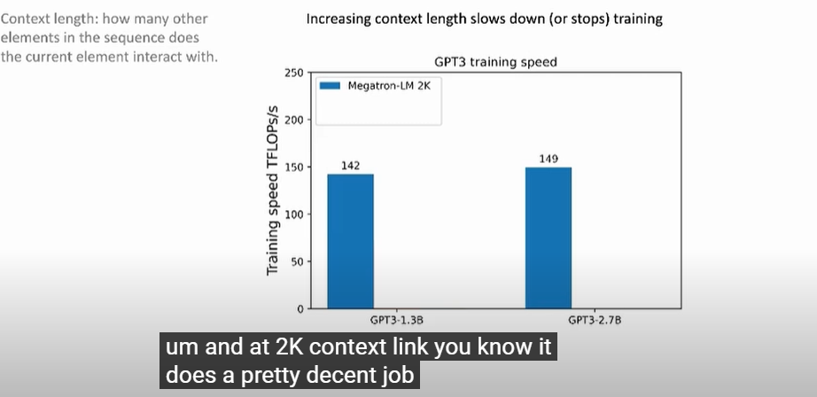
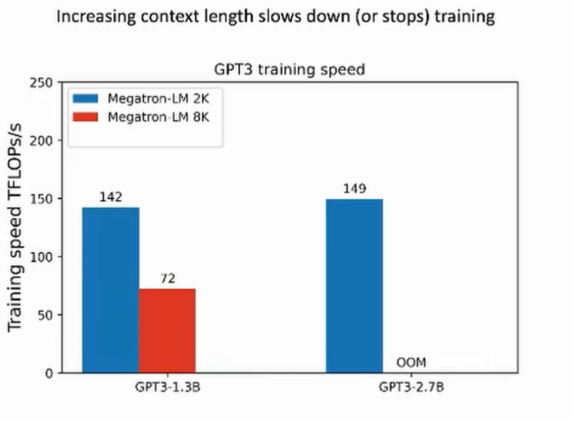
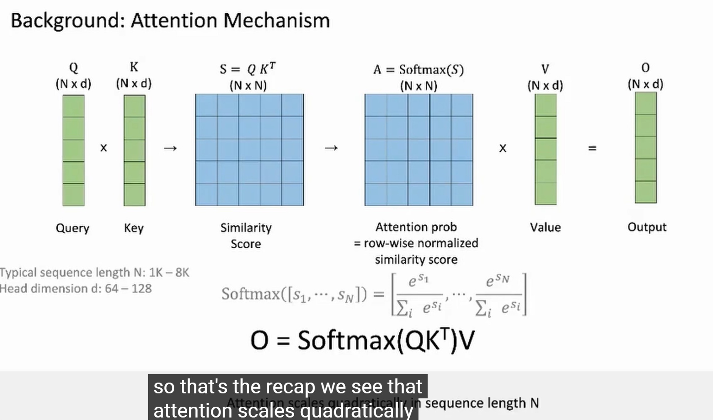
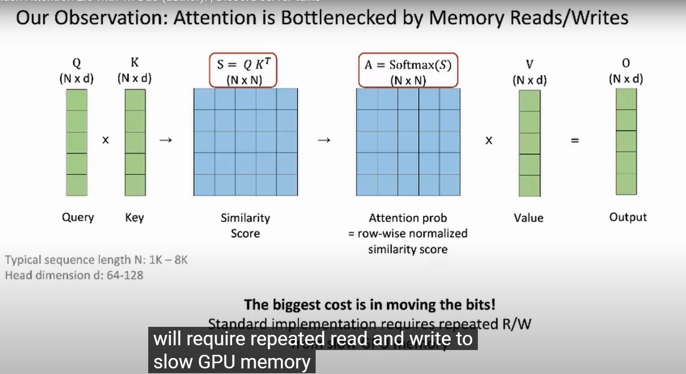
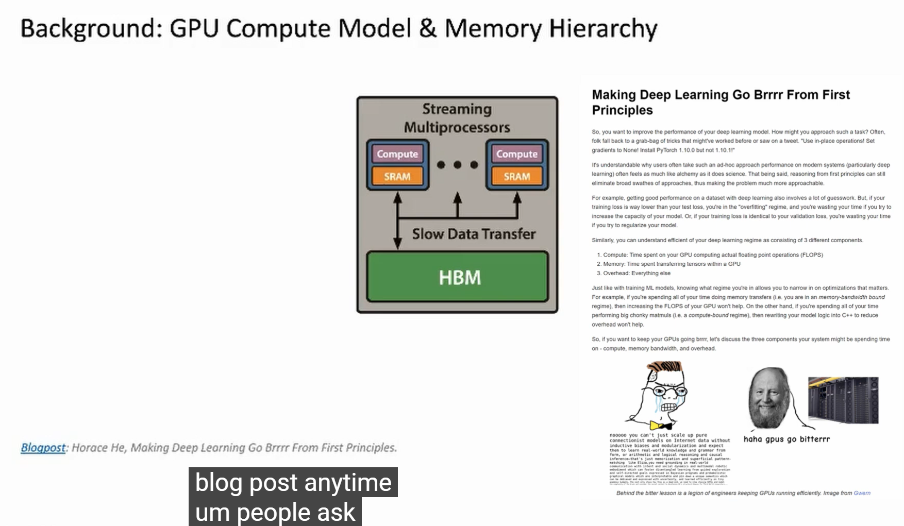
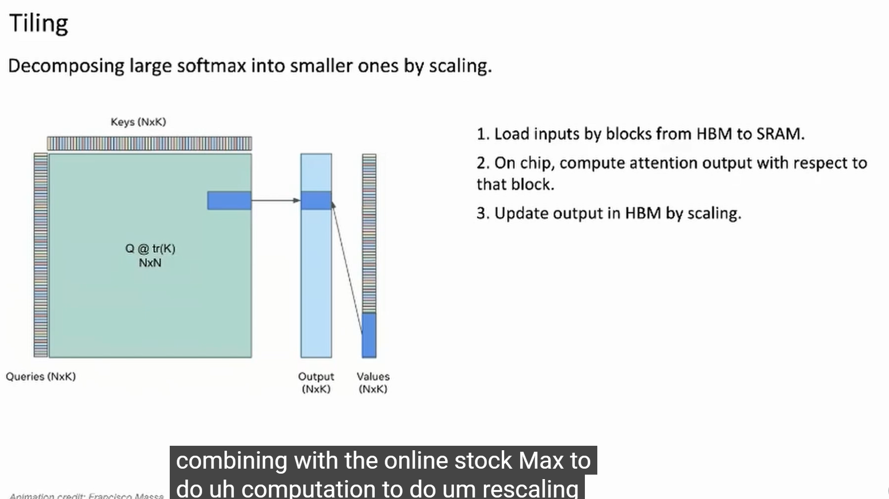
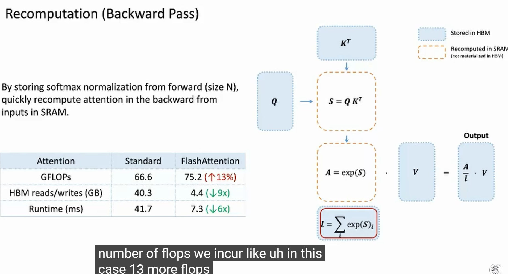
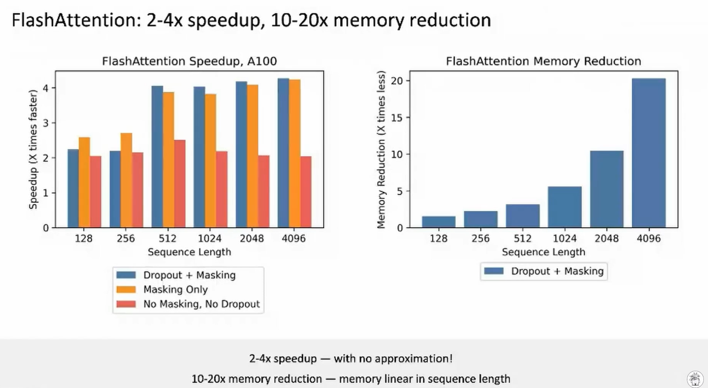
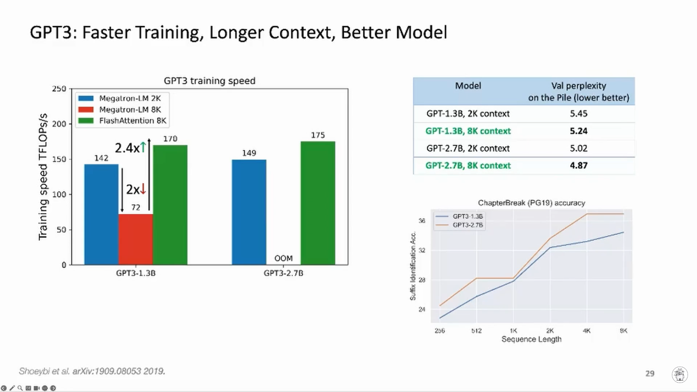

# Flash Attention

Rescources:

- ELI5:Flash Attention by Aleksa Gordic [Medium link](https://gordicaleksa.medium.com/eli5-flash-attention-5c44017022ad)
- Making Deep Learning Go Brrrr From First Principles by horace : [link](https://horace.io/brrr_intro.html)
- Flash Attention: Fast and Memory-Efficient Exact Attention with IO-Awareness paper by Tia Dao: [Paper](https://arxiv.org/pdf/2205.14135)
- Flash Attention2 paper by Tia Dao: [Paper](https://tridao.me/publications/flash2/flash2.pdf)
- Flash Attention3 paper by Tia Dao: [Paper](https://tridao.me/blog/2024/flash3/)
- [link](https://www.youtube.com/watch?v=IoMSGuiwV3g)

- training speed is the number of token process per second
- 
- 
- 
- 
- 
- 
- 
- 
- 

Deep dive - Better Attention layers for Transformer models [link](https://youtu.be/2TT384U4vQg?si=isWlxGtcy_RXjhPo) it covers all the attnetions
